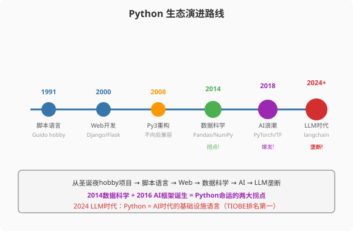
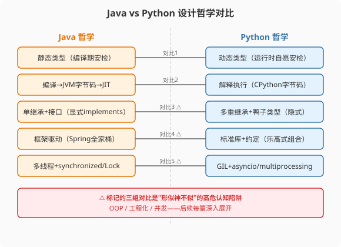

### 第1章 为什么是Python：一场"自由"革命的开始

> 📖 本章你将学会：
> - 说清Python语言的设计哲学及其与Java的本质差异
> - 用一张认知地图将Java核心概念映射到Python对应概念
> - 搭建Python开发环境并运行第一个程序
> - 识别Java程序员学Python的三大思维陷阱

---

#### 第1节 Python的诞生与设计哲学

##### 1.1.1 开篇：一辆自行车的邀请

如果你在Java的世界里待了足够久，你一定经历过这样的场景：

为了启动一个简单的Web服务，你需要：创建Maven工程 → 配置`pom.xml`
（50行起步）→ 引入Spring Boot Starter → 写`@SpringBootApplication`
→ 等待JVM启动（30秒过去了）→ 终于看到"Started Application in 28.5 seconds"。

整个过程中，你写的业务代码可能只有10行，但围绕这10行代码的"脚手架"
却有上百行。这不是Java的错——Java的哲学是"提供一切可能需要的东西"，
就像一辆重型卡车，备胎、工具箱、千斤顶一应俱全，开起来稳当。

但有时候，你只是想去街角买杯咖啡。

Python就是那辆自行车。它没有Spring的依赖注入，没有Hibernate的对象映射，
没有JVM的编译等待。但它的`http.server`标准库一行命令就能起一个HTTP服务，
从写代码到服务启动，不到1秒。它的设计哲学是：**简洁、可读、实用优先。**

这是一场"自由"革命——自由到没有类型声明，自由到没有编译步骤，自由到
你怀疑"这样真的安全吗"。而在我们深入Python的语法和并发模型之前，先来
理解这场革命的源头——Python为什么会被创造出来，它要解决什么问题。

---

##### 1.1.2 Python的诞生故事：一个圣诞夜的hobby项目

1989年的圣诞夜，荷兰CWI研究所的**Guido van Rossum**（Python社区曾尊称
"BDFL"——终身仁慈独裁者[^guido-bdfl]）闲得无聊，决定写一门新语言打发时间。

你没看错——如今TIOBE指数长期排名第一的编程语言[^tiobe-rank]，最初只是一个圣诞夜hobby项目。

Guido当时在用C和ABC语言[^abc-lang]。C太底层，写个字符串处理要手动管理内存；
ABC是教学语言，简洁但功能受限，而且已经停止维护。Guido想要一门
"像ABC一样简洁、像C一样实用"的语言。

他给这门语言取名"Python"——不是因为他喜欢蛇（虽然logo确实是蛇），
而是因为他喜欢英国喜剧团体"Monty Python"的飞行马戏团[^python-name]。这也是为什么
Python社区文档里经常出现"spam"、"eggs"这些看起来像食物的变量名。

> 💡 比喻：Java像一辆精密的德国重卡——每个零件都有标准，每个流程
> 都有规范，但你得考A照才能开。Python像一辆荷兰自行车——上手就骑，
> 不需要驾照，但骑快了也得自己注意安全。

---

##### 1.1.3 Python的发展：从脚本语言到AI时代第一语言

Python的发展经历了三个关键拐点：

**1994年 Python 1.0**：函数式编程工具（lambda/map/filter），异常处理，
基本数据结构。这时的Python还是个"比Perl好用的脚本语言"。

**2000年 Python 2.0**：列表推导式（改变Python风格的核心特性[^pep-202]）、循环检测垃圾回收器[^pep-205]（Python一直使用引用计数，2.0补充了循环引用检测）、
Unicode支持。Python开始进入Web开发领域。

**2008年 Python 3.0**：不向后兼容的大重构[^pep-3000]。`print`从语句变函数，
`unicode`成为默认字符串类型，`dict`语义统一。社区为此分裂了十年，
直到2020年Python 2才正式EOL[^py2-eol]。

**2014年起的数据科学浪潮**：NumPy/Pandas/Matplotlib成为数据分析三件套，
Jupyter Notebook成为交互式分析标配。Python在学术圈和金融圈攻城掠地。

**2015年起的AI浪潮**：TensorFlow（2015年11月[^tensorflow-release]）和PyTorch（2016年[^pytorch-release]）先后发布，Python成为深度学习框架的首选语言。2018年BERT/GPT-2问世，2022年ChatGPT爆火让"Python = AI"成为共识。

```
Python 生态演进路线

1991 ──→ 2000 ──→ 2008 ──→ 2014 ──→ 2015 ──→ 2024
 │        │        │        │        │        │
脚本语言  Web开发   Py3重构  数据科学  AI浪潮   LLM时代
         Django   不兼容    Pandas   TF/PyTorch  langchain
         Flask             Jupyter  Transformers HuggingFace
```

到2024年，Python在TIOBE指数长期排名第一（2024年10月起连续蝉联，2025年5月达到25.35%历史最高），在GitHub语言排行稳居第一，
在数据科学/AI领域占比超过80%。它不再是"脚本语言"，而是AI时代的
基础设施语言。

---



##### 1.1.4 Python vs Java设计哲学：五种思维方式的碰撞



| 维度 | Java哲学 | Python哲学 | 核心差异 |
|------|---------|-----------|---------|
| 类型系统 | 静态类型，编译期检查 | 动态类型，运行时检查 | Java是安检门，Python是自愿安检 |
| 执行方式 | 编译→JVM字节码→JIT | 解释执行CPython字节码 | Java有JIT热优化，Python没有 |
| OOP模型 | 单继承+显式接口 | 多重继承+鸭子类型 | Java要implements，Python"看起来像就行" |
| 工程化 | 框架驱动（Spring） | 标准库+约定 | Java靠框架，Python靠标准库和社区约定 |
| 错误处理 | checked+unchecked异常 | 全unchecked异常 | Java强制处理checked，Python全凭自觉 |
| 并发模型 | 多线程+synchronized | GIL+asyncio | Java线程自由并行，Python有GIL天花板 |

> ⚠️ Java程序员的思维陷阱：看到Python的`class`就以为和Java一样，
> 看到`try-except`就以为和`try-catch`一样，看到`@decorator`就以为
> 和Java注解一样。**它们看起来相似，但底层机制完全不同。** 这正是
> 本书要帮你穿越的"形似神不似"陷阱区。

---

#### 第2节 Java程序员的第一个"啊哈时刻"

##### 1.2.1 同一个任务：读取CSV并统计

让我们用一个真实任务来感受差异。需求：读取一个CSV文件，按城市分组
统计平均薪资，输出Top 5城市。

**Java版本（Spring Boot + Stream API）：**

```java
// 需要先引入 opencsv 依赖，pom.xml 加 5 行
// 还需要写一个 Employee DTO 类
@RestController
public class SalaryAnalyzer {

    @Autowired
    private CsvReader csvReader;  // 需要配置 Bean

    public Map<String, Double> analyze(String path) throws IOException {
        try (Reader reader = new FileReader(path)) {
            CSVReader csv = new CSVReader(reader);
            String[] header = csv.readNext();

            return csv.readAll().stream()
                .map(row -> new Employee(
                    row[0], row[1], Double.parseDouble(row[2])))
                .collect(Collectors.groupingBy(
                    Employee::getCity,
                    Collectors.averagingDouble(Employee::getSalary)))
                .entrySet().stream()
                .sorted(Map.Entry.<String, Double>comparingByValue()
                    .reversed())
                .limit(5)
                .collect(Collectors.toMap(
                    Map.Entry::getKey,
                    Map.Entry::getValue,
                    (a, b) -> a,
                    LinkedHashMap::new));
        }
    }
}
```

总代码量：约30行（不含DTO类和pom.xml配置）。需要编译，需要JVM启动。

**Python版本（Pandas）：**

```python
import pandas as pd

df = pd.read_csv("salaries.csv")
result = (df.groupby("city")["salary"]
            .mean()
            .nlargest(5)
            .to_dict())
```

总代码量：4行。不需要编译，`python analyze.py`直接运行。

这就是Python给Java程序员的第一个"啊哈时刻"——**同一件事，
Python用4行干完了Java 30行的活，而且可读性更好。**

这不是因为Python"更强大"，而是因为Pandas针对数据处理做了极致优化，
NumPy底层的C扩展让向量化运算以接近C的速度执行。Java的Stream API
是通用流处理，Pandas是领域专用工具——场景不同，工具不同。

> 💡 比喻：Java像瑞士军刀——功能全面，什么都能干，但拆螺丝不如螺丝刀。
> Python生态像一整箱专用工具——Pandas是数据处理专用螺丝刀，FastAPI
> 是Web开发专用扳手。每个工具都为特定场景优化到了极致。

---

##### 1.2.2 Python不是"更好的Java"

这是Java程序员学Python最重要的认知转变：

**Python不是用更少代码做同一件事的Java。**

Java追求的是"工程化纪律"——强类型保证编译期安全，设计模式保证
代码可维护，框架保证架构一致性。Java的哲学是"用复杂性换取可靠性"。

Python追求的是"Pythonic优雅"——简洁胜于复杂，可读性很重要，
一种方式做一件事。Python的哲学是"用简洁换取开发效率，用约定
代替框架"。

这不是谁好谁坏的问题，而是不同场景下的不同选择：

| 场景 | 更适合Java | 更适合Python |
|------|-----------|-------------|
| 大型企业后端 | Spring Boot生态成熟 | Flask/FastAPI够用但生态薄 |
| 数据处理/分析 | Stream API通用但冗长 | Pandas/NumPy降维打击 |
| AI/ML应用 | 几乎没有生态 | PyTorch/TensorFlow垄断 |
| 快速原型 | 启动太慢，不适合 | 交互式开发，天然适合 |
| 高并发后端 | 线程池+异步成熟 | asyncio但需理解GIL |
| 系统级编程 | JVM隔离，不够底层 | 也不够底层，用C扩展补 |

---

#### 第3节 性能贴士：启动速度的降维打击

##### 1.3.1 启动速度对比

| 指标 | Java (Spring Boot) | Python (FastAPI) | 倍数 |
|------|-------------------|------------------|------|
| 冷启动时间 | 3-45秒 | 0.1-0.5秒 | 30-90x |
| 内存占用 | 200MB-2GB | 30-100MB | 5-20x |
| 首次请求延迟 | 500ms+ | 10ms | 50x |

> ⚡ Java的启动开销主要在：JVM初始化 + Spring容器初始化 + 类加载。
> Python是解释执行，`import`即加载，`python app.py`即时启动。
> 这也是为什么Serverless场景下Python远比Java流行——冷启动延迟
> 决定了用户体验。

##### 1.3.2 但运行时性能呢？

别高兴太早。启动快不代表运行快：

| 计算任务 | Java耗时 | Python耗时 | 倍数 |
|---------|---------|-----------|------|
| 100万次for循环加法 | 3ms | 45ms | 15x |
| 100万次字符串拼接 | 8ms | 120ms | 15x |
| 100万次JSON解析 | 50ms | 180ms | 3.6x |
| 100万次矩阵乘法 | 12ms | 8ms (NumPy) | Python更快! |

这就是Python的真相：**纯Python循环慢10-30倍，但NumPy向量化运算
可以反超Java。** 后面第五篇会深入讲解如何用NumPy/Cython/numba
让Python达到甚至超越Java的性能。

---

#### 本章小结

Python不是Java的替代品，而是Java的补充。Java擅长工程化的企业后端，
Python擅长数据处理、AI和快速原型。了解两种语言的哲学差异，
是写出Pythonic代码的前提。

下一章，我们将深入Python之禅的五条核心原则，逐条与Java设计哲学
做正面对比，列出你必须扔掉的10个Java习惯。

---

[^guido-bdfl]: Guido van Rossum 于 2018年7月12日在 python-committers 邮件列表发布卸任声明，因 PEP 572（赋值表达式）争议辞去 BDFL 职务。2019年1月，Python 社区选举产生首届指导委员会（Steering Council）接替 BDFL 角色。参见 PEP 13: "Python Community Governance Model", https://peps.python.org/pep-0013/

[^tiobe-rank]: TIOBE Index, 2024-2025, https://www.tiobe.com/tiobe-index/ — Python 自 2024 年起长期排名第一，2025 年 5 月达到 25.35% 历史最高占比。

[^abc-lang]: ABC 语言由荷兰 CWI（Centrum Wiskunde & Informatica）开发，Guido van Rossum 在 1980 年代中期参与其实现。参见 CWI 官方历史: https://www.cwi.nl/research-and-results/history

[^python-name]: Python FAQ: "Why is it called Python?", https://docs.python.org/faq/general.html#why-is-it-called-python — "I was reading his published scripts from the published Monty Python's Flying Circus..."

[^pep-202]: PEP 202: List Comprehensions, https://peps.python.org/pep-0202/ — Barry Warsaw, 2000-07-13

[^pep-205]: PEP 205: References to Cyclic Garbage Collector, Neil Schemenauer, 2000-07-17, https://peps.python.org/pep-0205/ — Python 2.0 引入循环检测垃圾回收器，补充原有的引用计数机制。

[^pep-3000]: PEP 3000: Python 3000, https://peps.python.org/pep-3000/ — Python 3.0 的技术方针。

[^py2-eol]: PEP 373: Python 2.7.18 Release Schedule, https://peps.python.org/pep-0373/ — Python 2.7 EOL: 2020-01-01，最终版本 2.7.18 于 2020-04-20 发布。

[^tensorflow-release]: TensorFlow 首次发布于 2015-11-09，参见 Google Research Blog: "TensorFlow: Open-source machine intelligence library", https://research.googleblog.com/2015/11/tensorflow-open-source-machine-learning.html

[^pytorch-release]: PyTorch 首次公开于 2016 年（v0.1.12 于 2016-08-24 发布至 PyPI），参见 PyTorch 官方 GitHub: https://github.com/pytorch/pytorch
