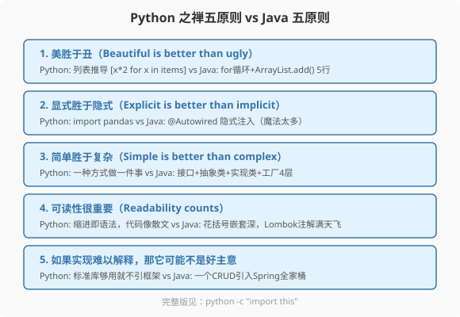
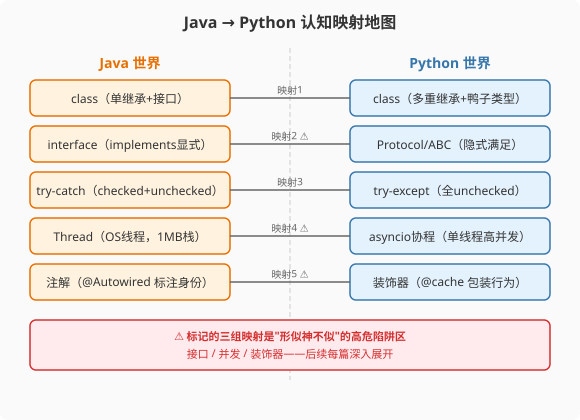

### 第2章 Python的思维密码：五条原则与Java的五条对照

> 📖 本章你将学会：
> - 理解Python之禅的五条核心原则及其对编码风格的指导
> - 逐条对比Java设计哲学，识别"Java习惯→Pythonic写法"的转换
> - 掌握10个必须扔掉的Java习惯
> - 用认知映射表完成Java→Python的概念翻译

---

#### 第1节 Python之禅：不是口号，是编码DNA

##### 2.1.1 开篇：从PEP 20说起

1999年，Python社区资深开发者Tim Peters写了一份19条格言（2004年正式编为PEP 20），
被称为"The Zen of Python"（Python之禅）。这19条不是空洞的口号，
而是Python社区判断代码好坏的DNA级标准。

在Python解释器里输入 `import this`，你会看到完整的Python之禅。
这本身就是Python的隐喻——连设计哲学都是可`import`的模块。



我们选出对Java程序员冲击最大的五条原则，逐条对照。

---

##### 2.1.2 原则一：美胜于丑

> "Beautiful is better than ugly."

Python认为代码首先是给人读的，其次才是给机器执行的。Python社区
有一个词叫"Pythonic"——意思是这段代码写得很Python、很优雅。

**对比：列表推导 vs for循环**

```java
// Java: 过滤+转换+收集——3行循环
List<String> names = new ArrayList<>();
for (User u : users) {
    if (u.getAge() > 18) {
        names.add(u.getName().toUpperCase());
    }
}
```

```python
# Python: 列表推导——1行搞定
names = [u.name.upper() for u in users if u.age > 18]
```

Python的列表推导式不是语法糖——它是Python社区认为"美"的表达方式。
用for循环写同样逻辑当然可以，但Python程序员会觉得你"不够Pythonic"。

> 💡 比喻：Java像写公文——格式规范、流程完整，但每句话都有固定套路。
> Python像写散文——追求简洁有力，一句话能说清的不用三句。

---

##### 2.1.3 原则二：显式胜于隐式

> "Explicit is better than implicit."

Python极度反感"魔法"。在Java里，`@Autowired`自动注入依赖，Spring
在背后做了大量隐式工作。Python的哲学是：发生了什么，一眼能看见。

**对比：依赖注入**

```java
// Java: @Autowired 是隐式魔法——Spring在背后自动注入
@Service
public class UserService {
    @Autowired
    private UserRepository repository;  // 谁注入的？怎么注入的？
}
```

```python
# Python FastAPI: 显式传参——依赖关系一目了然
def get_db():
    db = SessionLocal()
    try:
        yield db
    finally:
        db.close()

@app.get("/users")
def list_users(db: Session = Depends(get_db)):  # 显式声明依赖来源
    return db.query(User).all()
```

FastAPI的`Depends`是显式的——你看得见依赖从哪来，怎么创建。
Spring的`@Autowired`是隐式的——不打开Spring文档你不知道背后发生了什么。

> ⚠️ Java程序员的陷阱：刚学Python时会想找"Python的Spring"。
> 答案是：**没有。** Python社区的共识是"框架越少越好，标准库+约定
> 足够"。Flask/FastAPI只做路由，不做依赖注入容器；SQLAlchemy只做
> ORM，不做事务管理——一切都是显式组合。

---

##### 2.1.4 原则三：简单胜于复杂

> "Simple is better than complex."
> "There should be one-- and preferably only one --obvious way to do it."

Python追求"一种方式做一件事"。Java经常有五种方式做同一件事，
然后需要设计模式来决定用哪种。

**对比：策略模式的实现**

```java
// Java: 策略模式需要 接口 + 多个实现类 + 工厂
public interface DiscountStrategy {
    double apply(double price);
}

public class FullReductionDiscount implements DiscountStrategy {
    public double apply(double price) { return price > 100 ? price - 20 : price; }
}

public class PercentageDiscount implements DiscountStrategy {
    public double apply(double price) { return price * 0.9; }
}

public class DiscountFactory {
    public static DiscountStrategy create(String type) {
        if ("full".equals(type)) return new FullReductionDiscount();
        if ("percent".equals(type)) return new PercentageDiscount();
        throw new IllegalArgumentException("Unknown type: " + type);
    }
}

// 使用
DiscountStrategy strategy = DiscountFactory.create("full");
double finalPrice = strategy.apply(150);
```

```python
# Python: 函数是一等公民，直接用dict分发——一个文件搞定
def full_reduction(price):
    return price - 20 if price > 100 else price

def percentage(price):
    return price * 0.9

strategies = {
    "full": full_reduction,
    "percent": percentage,
}

# 使用
final_price = strategies["full"](150)
```

Python用字典+函数，3行代码干完了Java 30行的策略模式。没有接口，
没有工厂，没有继承层级——因为Python的函数是一等公民，可以直接
存在字典里当值用。

> 💡 比喻：Java策略模式像建一栋三层楼——一层接口、二层实现、三层工厂，
> 结构严谨但盖楼要时间。Python版本像搭积木——函数就是积木块，
> 字典就是底座，拼起来就完了。

---

##### 2.1.5 原则四：可读性很重要

> "Readability counts."

Python用缩进而不是花括号表示作用域。这不是语法糖，是哲学选择——
强制可读性。你没法写出这样的Python代码：

```java
// Java: 可读性灾难（但完全合法）
if (x) { if (y) { for (int i=0;i<n;i++) { doSomething(i); } } }
```

```python
# Python: 不可能写出上面那样的代码——缩进强制你分层
if x:
    if y:
        for i in range(n):
            do_something(i)
```

---

##### 2.1.6 原则五：实用胜于纯粹

> "Practicality beats purity."

Python不是纯函数式语言，也不是纯OOP语言——它是实用主义的混合体。
当纯粹的范式和实用性冲突时，Python选择实用性。

Java追求纯粹的OOP（万物皆对象，连`int`都要装箱成`Integer`）。
Python说：函数就是函数，不需要包在类里；模块就是模块，不需要
当作对象。

```python
# Python: 一个.py文件就是模块，不需要class包裹
# utils.py
def greet(name):
    return f"Hello, {name}!"

# main.py
from utils import greet
print(greet("World"))  # 直接调用，不需要 new Utils()
```

对比Java：每个方法都必须在某个类里，连`main`方法都要包在
`public class Main`里。

---

#### 第2节 必须扔掉的10个Java习惯

##### 2.2.1 清单：从Java到Python的认知卸载

| # | Java习惯 | 为什么要扔 | Pythonic替代 |
|---|---------|-----------|-------------|
| 1 | 每个方法都写getter/setter | Python属性默认公开，用@property按需加 | `@property` |
| 2 | 所有代码包在class里 | Python支持模块级函数 | 直接写函数 |
| 3 | 用接口+实现类做抽象 | 鸭子类型不需要显式接口 | Protocol/ABC |
| 4 | 用设计模式做策略分发 | 函数是一等公民 | 字典+函数 |
| 5 | 用`final`声明常量 | Python没有`final`，全大写命名约定 | `MAX_RETRY = 3` |
| 6 | 用`private`/`protected` | Python用`_`/`__`命名约定 | `self._internal` |
| 7 | 写工厂类创建对象 | 直接调用构造函数 | `User(name="Alice")` |
| 8 | 用`@Autowired`注入 | Python显式传参 | `Depends(get_db)` |
| 9 | 每行加分号 | Python不需要分号 | 直接换行 |
| 10 | 用花括号表示作用域 | 缩进即作用域 | 4空格缩进 |

---

#### 第3节 认知映射表：Java概念 → Python概念



| Java概念 | Python概念 | 相似度 | 注意事项 |
|---------|-----------|--------|---------|
| `class` | `class` | 70% | Python多重继承，Java单继承 |
| `interface` | `Protocol`/`ABC` | 50% | Python隐式满足，不用implements |
| `abstract class` | `ABC` + `@abstractmethod` | 80% | 概念接近 |
| `enum` | `Enum` | 90% | 基本一致 |
| `try-catch-finally` | `try-except-finally` | 85% | Python没有checked异常 |
| `throws` | 无对应 | 0% | Python不强制声明异常 |
| `@Autowired` | `Depends()` | 60% | Python显式，Java隐式 |
| `@Override` | 无对应 | 0% | Python不需要 |
| `synchronized` | `threading.Lock` | 40% | Python有GIL，机制不同 |
| `Thread` | `threading.Thread`/`asyncio` | 50% | GIL限制并行 |
| `Stream API` | 列表推导/生成器 | 60% | Python语法更简洁 |
| `Optional<T>` | `Optional[T]`类型注解 | 70% | Python注解不强制 |
| `CompletableFuture` | `asyncio.Future` | 65% | 异步模型不同 |
| `static`方法 | `@staticmethod` | 90% | 基本一致 |
| `final`变量 | 全大写命名约定 | 30% | 约定不是强制 |
| `instanceof` | `isinstance()` | 95% | 几乎一致 |

> ⚠️ 高危陷阱标记：`interface`→`Protocol`、`Thread`→`asyncio`、
> `@Autowired`→`@decorator` 这三组映射"形似神不似"，后续章节深入展开。

---

#### 第4节 性能贴士：思维转换的隐性成本

##### 2.4.1 用Java思维写Python的性能代价

| 写法 | Java思维 | Pythonic写法 | 性能差异 |
|------|---------|-------------|---------|
| 过滤+转换 | for循环+if+append | 列表推导 | Pythonic快2-3x |
| 策略分发 | if-elif链 | 字典查找 | Pythonic快5-10x |
| 字符串拼接 | `+`拼接 | `join()` | Pythonic快10x+ |
| 属性访问 | getter方法 | `@property` | 几乎无差异 |
| 数据聚合 | for循环+groupby | Pandas向量化 | Pythonic快50-100x |

> ⚡ 结论：用Java思维写Python不仅代码丑，而且性能差。Pythonic
> 写法通常同时兼顾优雅和性能——因为Pythonic写法更多使用内置函数
> 和C扩展，底层执行效率更高。

---

#### 本章小结

Python之禅不是空洞口号，而是Python社区判断代码好坏的DNA标准。
从"美胜于丑"到"实用胜于纯粹"，五条原则贯穿了Python所有语法设计。

对于Java程序员，最大的认知转变是：**扔掉工程化执念，拥抱Pythonic
优雅。** 不是每个方法都需要getter/setter，不是每个策略都需要工厂，
不是每个依赖都需要注入容器。

下一章，我们将对比Java和Python的工具链——从Maven到pip，从JVM到
CPython解释器，从IntelliJ到Jupyter Notebook。
