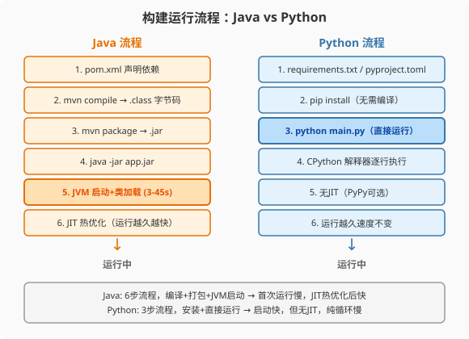
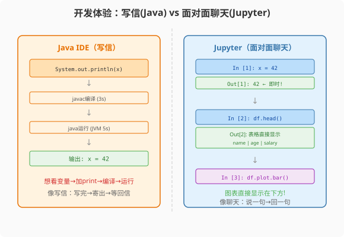

### 第3章 工具链与环境：从Maven到pip的降维打击

> 📖 本章你将学会：
> - 理解JVM编译执行与CPython解释执行的本质差异
> - 对比Maven/Gradle与pip/poetry的依赖管理模型
> - 掌握Python虚拟环境（venv）的使用及其存在原因
> - 体验Jupyter Notebook——Java程序员从未有过的交互式开发

---

#### 第1节 执行模型：编译执行 vs 解释执行

##### 3.1.1 开篇：两种"翻译"方式

Java代码需要"翻译"两次：第一次由`javac`编译成`.class`字节码，
第二次由JVM的JIT编译器把热点字节码翻译成机器码。Python代码
只需要"翻译"一次：CPython解释器逐行把源码翻译成字节码并立即执行。



> 💡 比喻：Java像写信——先写好草稿（源码），翻译成标准格式（字节码），
> 寄给收件人（JVM），JVM再翻译成当地语言（机器码）执行。
> Python像同声传译——你说一句，翻译一句，当场执行。同声传译更快
> 开场，但没有时间做深度优化。

---

##### 3.1.2 Java的两次翻译

```bash
# Java: 显式编译 + 运行
javac Main.java       # → Main.class（JVM字节码）
java Main             # JVM加载字节码 → 解释执行 → JIT热点编译
```

JVM的JIT（Just-In-Time）编译器会在运行时把"热点代码"（频繁执行的
方法/循环）编译成优化的机器码。这意味着**Java程序运行越久越快**——
前1000次调用走解释器，之后走JIT优化机器码。

---

##### 3.1.3 Python的一次翻译

```bash
# Python: 无显式编译，直接运行
python main.py        # CPython → 字节码（内存中）→ 立即执行
```

CPython执行流程：

```
源码(.py) → 词法分析 → AST → 字节码(.pyc缓存) → 解释器逐条执行
```

关键区别：
- Python也有字节码，但默认缓存在`__pycache__/*.pyc`中，不需要显式编译
- CPython**没有JIT**——字节码始终由解释器逐条执行，不会在运行时优化成机器码
- PyPy是另一个Python实现，带有JIT，纯Python循环比CPython快4-5倍

| 指标 | Java (HotSpot JVM) | Python (CPython) | Python (PyPy) |
|------|-------------------|------------------|---------------|
| 编译方式 | AOT + JIT | 解释执行 | JIT |
| 纯循环性能 | 基准 | 15-30x慢 | 3-5x慢 |
| 启动速度 | 慢（3-45s） | 快（0.1s） | 中等（1-2s） |
| 运行越久 | 越快（JIT优化） | 不变 | 越快（JIT优化） |

> ⚡ 为什么CPython不用JIT？历史包袱。CPython的C扩展生态极其庞大
> （NumPy/Pandas/TensorFlow都是C扩展），引入JIT需要重写整个执行引擎，
> 会破坏C扩展兼容性。PyPy虽然快，但很多C扩展跑不了——这就是为什么
> 数据科学领域依然用CPython。

---

#### 第2节 包管理：Maven vs pip

##### 3.2.1 依赖声明对比

```xml
<!-- Maven: pom.xml，冗长但精确 -->
<dependencies>
    <dependency>
        <groupId>org.springframework.boot</groupId>
        <artifactId>spring-boot-starter-web</artifactId>
        <version>3.2.0</version>
    </dependency>
</dependencies>
```

```toml
# pyproject.toml (现代Python推荐)，简洁
[project]
dependencies = [
    "fastapi>=0.104",
    "uvicorn>=0.24",
]
```

```txt
# requirements.txt (传统但最常见)，最简
fastapi>=0.104
uvicorn>=0.24
```

| 维度 | Maven | pip + requirements.txt | pip + pyproject.toml |
|------|-------|----------------------|---------------------|
| 语法 | XML，冗长 | 纯文本，最简 | TOML，结构化 |
| 版本锁定 | pom.xml + lock | pip freeze | poetry.lock |
| 依赖树 | mvn dependency:tree | pip show / pipdeptree | poetry show --tree |
| 速度 | 慢（解析XML+下载） | 快 | 快 |
| 全局/隔离 | 全局（~/.m2） | 默认全局，venv隔离 | venv隔离 |

---

##### 3.2.2 虚拟环境：Python特有的需求

Java的依赖放在`~/.m2/repository`全局共享，项目之间不冲突，因为
Java有编译期类型检查——不同版本的jar在编译时就会报错。

Python需要虚拟环境，因为**同一个包的不同版本可能全局冲突**。

```bash
# Python: 虚拟环境隔离
python -m venv .venv          # 创建虚拟环境
source .venv/bin/activate     # 激活（macOS/Linux）
pip install pandas==2.1       # 安装到虚拟环境，不影响全局

# 项目A用 pandas 1.5，项目B用 pandas 2.1——互不干扰
```

Java不需要虚拟环境，因为Maven通过`groupId:artifactId:version`
唯一定位依赖，不同版本的jar可以共存于`~/.m2`中。

> 💡 比喻：Java的依赖管理像图书馆——每本书有唯一ISBN，不同版本
> 共存，借书时按ISBN精确查找。Python的pip像个人书架——如果不
> 用虚拟环境隔离开，新版书会覆盖旧版书。

---

##### 3.2.3 包管理工具演进

| 工具 | 定位 | 对应Java工具 | 推荐场景 |
|------|------|-------------|---------|
| pip | 基础安装器 | 无直接对应 | 日常安装 |
| venv | 虚拟环境 | 不需要 | 项目隔离 |
| pip-tools | 依赖锁定 | Maven lock | 生产锁定 |
| poetry | 全生命周期管理 | Maven/Gradle | 现代项目推荐 |
| conda | 科学计算专用 | 无 | 数据科学/AI |

---

#### 第3节 IDE与交互式开发

##### 3.3.1 IDE对比

| 功能 | IntelliJ IDEA (Java) | PyCharm (Python) | Jupyter Notebook |
|------|---------------------|------------------|-----------------|
| 代码补全 | 极强（类型推断） | 中等（动态类型限制） | 基础 |
| 重构 | 极强 | 强 | 无 |
| 调试 | 强 | 强 | 逐cell执行 |
| 交互执行 | 无 | 有（但弱） | **核心功能** |
| 数据可视化 | 无 | 弱 | **核心功能** |
| 即时反馈 | 无 | 弱 | **核心功能** |

---



##### 3.3.2 Jupyter Notebook：Java程序员从未有过的体验

这是Python给Java程序员最大的震撼之一。

在Java里，写代码是"编译→运行→看输出"的循环。你想看某个变量的值，
得加`System.out.println()`，重新编译，重新运行。

在Jupyter Notebook里，每个cell可以独立执行，执行结果即时显示在下方。
你可以逐行探索数据，即时看到中间结果，甚至直接在代码cell里画图。

```python
# Cell 1: 加载数据
import pandas as pd
df = pd.read_csv("sales.csv")
df.head()  # 执行后直接显示表格

# Cell 2: 快速统计
df.describe()  # 执行后显示统计摘要

# Cell 3: 画图
import matplotlib.pyplot as plt
df.groupby("city")["revenue"].sum().plot.bar()
plt.show()  # 执行后直接显示柱状图
```

> 💡 比喻：Java开发像写信——写完整封信，装信封，寄出去，等回信。
> Jupyter开发像面对面聊天——说一句，对方回一句，你根据回复再说下一句。
> 这对数据探索和原型开发来说是革命性的——你的思维和代码同步前进。

---

#### 第4节 性能贴士：工具链的性能影响

##### 3.4.1 构建速度对比

| 操作 | Maven | pip | 倍数 |
|------|-------|-----|------|
| 全新安装10个依赖 | 15-30s | 3-5s | 5-6x |
| 增量更新1个依赖 | 5-10s | 1-2s | 5x |
| 清理重建 | 30-60s | 5-8s | 6-7x |

##### 3.4.2 运行时内存对比

| 运行时 | 空载内存 | 倍数 |
|--------|---------|------|
| Spring Boot 3.2 | 250-400MB | 基准 |
| FastAPI + uvicorn | 30-50MB | 5-8x少 |
| 纯Python进程 | 10-15MB | 20x少 |

> ⚡ Serverless场景下，Python的快速启动+低内存占用是巨大优势。
> AWS Lambda的冷启动：Java 3-10秒，Python 0.1-0.5秒。这就是为什么
> Serverless领域Python远比Java流行。

---

#### 本章小结

Java和Python的工具链反映了两种不同的工程哲学：Java追求编译期安全
和运行时优化，代价是复杂的构建流程和缓慢的启动；Python追求快速
启动和交互式开发，代价是没有JIT和运行时性能较低。

Jupyter Notebook是Python生态给Java程序员的最大惊喜——交互式
开发体验会改变你对"写代码"这件事的理解。如果你还没试过，现在
就打开[Google Colab](https://colab.research.google.com)体验一下。

第一篇到此结束。你已经完成了认知映射——理解了Python不是"更差的Java"，
而是"不同的思维方式"。下一篇开始，我们将深入Python核心语法，
逐个知识点和Java做正面对比。
