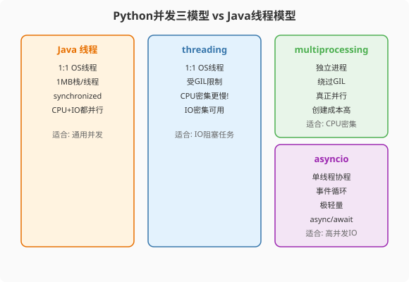

### 第12章 并发模型概览：从多车道高速到单车道收费站

> 📖 本章你将学会：
> - 理解GIL全局解释器锁的本质与历史成因
> - 区分threading/multiprocessing/asyncio三种并发方案的适用场景
> - 根据任务类型（CPU密集/IO密集/混合）选择正确的并发方案
> - 理解Python并发与Java并发模型的根本差异

---

#### 第1节 GIL：Python并发的天花板

##### 1.1.1 什么是GIL

GIL（Global Interpreter Lock，全局解释器锁）是CPython解释器实现中的一把互斥锁——**同一时刻只有一个线程能执行Python字节码**[^gil-doc]。这意味着Python的`threading`模块虽然能创建多线程，但CPU密集型任务无法真正并行执行。

GIL不是Python语言的特性，而是CPython实现的产物。Jython（Java平台上的Python）和IronPython（.NET平台）没有GIL，可以真正多线程并行[^jython-gil]。但绝大多数Python开发者使用的是CPython，所以GIL在实际开发中就是"事实标准"。

> 💡 **比喻**：Java多线程像多车道高速公路——N辆车同时跑，各走各的车道。Python threading像单车道收费站——不管你开几辆车（线程），同一时刻只有一辆车过站（执行字节码）。但IO等待时（车停下加油），GIL会释放，其他车可以过站——所以IO密集型多线程仍然有效。

##### 1.1.2 GIL为什么存在

GIL的存在不是设计失误，而是一个历史权衡[^gil-history]。

CPython的内存管理使用**引用计数**（reference counting）——每个对象内部维护一个引用计数器，当计数器归零时自动回收内存。这在单线程下简洁高效，但在多线程下，如果多个线程同时修改同一个对象的引用计数，会导致计数错误，进而引发内存泄漏或提前释放。

解决这个问题有两种方案：

- **方案一：细粒度锁**。给每个对象加一把锁，保护引用计数的修改。但这意味着每次对象操作都要加锁/解锁，性能开销巨大。
- **方案二：GIL**。用一把全局锁保护整个解释器，同一时刻只允许一个线程执行Python字节码。简单粗暴，但避免了细粒度锁的开销。

Guido van Rossum在1990年代选择了方案二——当时的CPU都是单核，多线程主要用于IO并发而非CPU并行，GIL的代价几乎为零。这个选择一直延续至今。

> 💡 **Java对比**：Java的JVM用**并发标记-清除**（concurrent mark-sweep）垃圾回收，天然支持多线程并行。Python的引用计数+GIL是另一条技术路线，各有取舍。

##### 1.1.3 GIL的释放时机

GIL并非全程持有，它在以下情况会释放[^gil-release]：

1. **IO操作**：文件读写、网络请求、`time.sleep()`——IO等待时线程主动释放GIL
2. **时间片到期**：Python 3.2+改为基于时间的切换间隔，默认5ms，可通过`sys.setswitchinterval()`调整[^gil-switchinterval]。Python 2则是每100条字节码指令检查一次，通过`sys.setcheckinterval()`控制
3. **C扩展主动释放**：NumPy等C扩展在执行计算时可以通过`Py_BEGIN_ALLOW_THREADS`/`Py_END_ALLOW_THREADS`宏主动释放GIL

```python
import sys

# 查看当前GIL切换间隔（Python 3.2+）
print(sys.getswitchinterval())  # 0.005（5毫秒）

# 调整切换间隔（一般不需要改）
# sys.setswitchinterval(0.001)  # 1毫秒——更频繁切换，但开销增大
```

**关键结论**：
- IO密集型多线程**有效**——一个线程等IO时，其他线程可以执行
- CPU密集型多线程**无效甚至更慢**——GIL争抢本身的上下文切换开销可能超过并行收益

---

#### 第2节 三种并发方案的适用场景



Python提供三种并发方案，各有适用场景。Java开发者最容易犯的错误，是不分场景地用`threading`应对一切——这在Java里可行，在Python里会踩坑。

##### 1.2.1 场景对照表

| 任务类型 | Java方案 | Python方案 | 原因 |
|---------|---------|-----------|------|
| CPU密集型 | 多线程 / ForkJoinPool | multiprocessing | GIL阻止线程并行 |
| IO密集型（少量连接） | 多线程 | threading | GIL在IO时释放，够用 |
| IO密集型（海量连接） | NIO / Netty | asyncio | 协程比线程轻500倍 |
| 混合型（CPU+IO） | 线程池 + 异步 | multiprocessing + asyncio | 分而治之 |

##### 1.2.2 决策树

```python
# Python并发方案决策树
def choose_concurrency(task_type, connection_count):
    if task_type == "CPU密集":
        return "multiprocessing"  # 绕过GIL，真正并行
    elif task_type == "IO密集" and connection_count < 100:
        return "threading"        # GIL在IO时释放，够用
    elif task_type == "IO密集" and connection_count >= 100:
        return "asyncio"          # 协程，单线程高并发
    elif task_type == "混合":
        return "multiprocessing + asyncio"  # CPU用进程，IO用协程
```

> 💡 **Java老兵的误区**：在Java里，`ThreadPoolExecutor`是万能工具——CPU密集和IO密集都能用，只需调整线程数。在Python里，threading**不能**用于CPU密集型任务——GIL让它比单线程还慢。这是Python并发学习的第一个，也是最重要的认知转变。

---

#### 第3节 并发单元的资源对比

理解三种方案的性能差异，关键在于它们的"并发单元"资源开销不同。

##### 1.3.1 资源开销对比

| 方案 | 并发单元 | 创建成本 | 内存/单位 | CPU并行 | 适用场景 |
|------|---------|---------|----------|---------|---------|
| Java Thread | 操作系统线程 | ~1ms | 1MB（栈） | ✅ | 通用 |
| Python Thread | 操作系统线程 | ~1ms | 8MB（栈）[^thread-stack] | ❌（GIL） | IO少量 |
| Python Process | 操作系统进程 | ~30ms | 30MB+ | ✅ | CPU密集 |
| Python asyncio Task | 协程（用户态） | ~1μs | 2KB | ❌（单线程） | IO海量 |

##### 1.3.2 为什么差距如此之大

**线程 vs 协程**：Java线程和Python线程都是操作系统线程，创建需要系统调用，内存由操作系统分配栈空间。协程是用户态的轻量级"函数"，创建只需分配一个栈帧，切换不需要系统调用。

**进程 vs 线程**：进程拥有独立的内存空间和Python解释器实例，创建时需要`fork()`（Linux）或`spawn()`（macOS/Windows）系统调用，内存需要复制或重新初始化。但每个进程有独立的GIL，所以能真正并行。

```python
# 10万并发连接的内存对比
# Java线程池：100,000 × 1MB = 100GB（不可能）
# Python asyncio：100,000 × 2KB = 200MB（轻松）
```

> ⚡ **性能直觉**：Java线程1MB栈 vs Python协程2KB——差500倍。这就是asyncio在高并发IO场景下远比Java线程池高效的原因：10万并发连接，Java线程池需要100GB内存，asyncio只需要200MB。

---

#### 第4节 Java vs Python 并发心智模型对比

这是本章的核心——帮助Java开发者建立Python并发的心智模型。

##### 1.4.1 Java的并发心智模型

Java开发者的并发心智是"多线程=并行"：

```java
// Java：4个线程在4核CPU上真正并行
ExecutorService pool = Executors.newFixedThreadPool(4);
for (int i = 0; i < 4; i++) {
    pool.submit(() -> cpuHeavyTask());
}
// 4核CPU跑满，理论上4倍加速
```

Java的线程模型直接映射到操作系统线程，多核CPU上可以真正并行。`synchronized`和`Lock`用于保护共享数据，线程间通信通过共享内存。

##### 1.4.2 Python的并发心智模型

Python开发者的并发心智是"分场景选工具"：

```python
# Python：4个线程在4核CPU上——串行执行（GIL）
from threading import Thread
threads = [Thread(target=cpu_heavy) for _ in range(4)]
for t in threads: t.start()
for t in threads: t.join()
# 4核CPU只用了1核，而且比单线程更慢（GIL争抢开销）

# 正确做法：4个进程在4核CPU上——真正并行
from multiprocessing import Pool
with Pool(4) as pool:
    pool.map(cpu_heavy, range(4))
# 4核CPU跑满，接近4倍加速
```

Python的并发模型不是Java多线程的"弱化版"，而是一套**不同场景不同工具**的体系。理解这一点，是从"Java并发思维"切换到"Python并发思维"的关键。

##### 1.4.3 心智模型对照表

| 维度 | Java并发 | Python并发 |
|------|---------|-----------|
| 默认方案 | 多线程 | 分场景：进程/线程/协程 |
| 并行能力 | 多核并行（线程） | 多核并行（进程） |
| 并发能力 | 线程池 | 协程（asyncio） |
| 共享数据 | 共享内存 + 锁 | 进程间需序列化 / 协程单线程无需锁 |
| 心智负担 | 锁/死锁/可见性 | 选对工具 / 协程异步思维 |

---

#### 第5节 实战示例：同一个任务的三种写法

用一个真实任务来感受差异：下载100个URL的内容并解析。

**方案一：threading（IO密集少量并发）**

```python
import threading
import requests
import time

def fetch(url):
    response = requests.get(url)
    return response.text

urls = [f"https://httpbin.org/delay/{i%3}" for i in range(100)]

start = time.time()
threads = []
results = []
lock = threading.Lock()

def task(url):
    data = fetch(url)
    with lock:
        results.append(data)

for url in urls:
    t = threading.Thread(target=task, args=(url,))
    threads.append(t)
    t.start()

for t in threads:
    t.join()

print(f"threading 100请求: {time.time()-start:.2f}s")
# ~15s（100个线程，GIL在IO时释放，有效并发）
```

**方案二：asyncio（IO密集海量并发）**

```python
import asyncio
import aiohttp
import time

async def fetch(session, url):
    async with session.get(url) as response:
        return await response.text()

async def main():
    urls = [f"https://httpbin.org/delay/{i%3}" for i in range(100)]
    async with aiohttp.ClientSession() as session:
        tasks = [fetch(session, url) for url in urls]
        results = await asyncio.gather(*tasks)
        return results

start = time.time()
asyncio.run(main())
print(f"asyncio 100请求: {time.time()-start:.2f}s")
# ~3s（单线程协程，100个并发，无GIL争抢）
```

**方案三：multiprocessing（CPU密集型对比）**

```python
from multiprocessing import Pool
import time

def cpu_heavy(n):
    """CPU密集型任务：质数筛"""
    sieve = [True] * n
    for i in range(2, int(n**0.5) + 1):
        if sieve[i]:
            for j in range(i*i, n, i):
                sieve[j] = False
    return sum(sieve)

if __name__ == "__main__":
    numbers = [10_000_000] * 4

    # 单进程
    start = time.time()
    for n in numbers:
        cpu_heavy(n)
    single = time.time() - start
    print(f"单进程: {single:.2f}s")

    # 4进程并行
    start = time.time()
    with Pool(4) as pool:
        results = pool.map(cpu_heavy, numbers)
    multi = time.time() - start
    print(f"4进程: {multi:.2f}s")
    print(f"加速比: {single/multi:.1f}x")
    # 单进程: ~12s, 4进程: ~3s, 加速比: ~4x
```

> 💡 **Java老兵的洞察**：在Java里，上面三个场景都可以用`ThreadPoolExecutor`解决——只需调整线程数。在Python里，你必须根据任务类型选择不同工具。这看起来更麻烦，但每个工具都在其领域做到了极致优化。

---

#### 第6节 PEP 703：GIL的未来

2023年，PEP 703被正式接受，CPython将支持**实验性的free-threaded模式**（移除GIL）[^pep-703]。Python 3.13（2024年10月发布）首次提供了实验性的no-GIL构建。

这意味着Python并发的未来可能发生根本变化：

| 特性 | Python 3.12及之前 | Python 3.13+（实验性） |
|------|------------------|----------------------|
| GIL | 始终存在 | 可选关闭（实验性） |
| threading CPU并行 | ❌ | ✅（no-GIL模式） |
| C扩展兼容性 | 全部兼容 | 需要适配 |
| 性能 | 单线程优化好 | 单线程可能略慢 |

> ⚠️ **注意**：no-GIL Python目前处于实验阶段，大多数C扩展（包括NumPy/Pandas）尚未完全适配。在本书编写时（2025年），生产环境仍建议使用标准CPython（带GIL）+ multiprocessing/asyncio方案。本书的并发章节基于标准CPython（带GIL）编写。

---

#### 性能贴士

| 场景 | 推荐方案 | 预期效果 |
|------|---------|---------|
| CPU密集型（纯计算） | multiprocessing | 接近N倍加速（N=CPU核数） |
| IO密集型（<100连接） | threading | 3-5倍加速 |
| IO密集型（≥100连接） | asyncio | 10-50倍加速 |
| CPU+IO混合 | multiprocessing + asyncio | 分而治之 |

> ⚡ **选择铁律**：CPU密集→multiprocessing，IO密集→asyncio（大量）或threading（少量），混合→分而治之。永远不要用threading做CPU密集型任务——GIL争抢会让它比单线程还慢。

---

#### 本章小结

Python并发不是Java多线程的简单翻译——GIL改变了游戏规则。

- **CPU密集型**用multiprocessing绕过GIL，实现真正的多核并行
- **IO密集型**用asyncio发挥协程优势，单线程支撑海量并发
- **少量IO**用threading即可，GIL在IO时释放，够用
- **混合场景**分而治之：CPU部分用进程池，IO部分用协程

选错工具不仅不加速，还可能比单线程更慢——CPU密集型多线程的GIL争抢开销是Python并发最常见的坑。

下面三章分别深入这三种方案：第13章讲GIL机制与threading，第14章讲multiprocessing，第15章讲asyncio。

---

[^gil-doc]: Python 官方文档, "Glossary: Global Interpreter Lock", https://docs.python.org/3/glossary.html#term-global-interpreter-lock — "The mechanism used by the CPython interpreter to assure that only one thread executes Python bytecode at a time."

[^jython-gil]: Jython FAQ, "What is the GIL?", https://www.jython.org/jython-old-sites/wiki/FAQ — Jython 没有 GIL，可以真正多线程并行。

[^gil-history]: Jesse Noller, "Python Threads and the Global Interpreter Lock", PyCon 2009 演讲 — CPython 使用引用计数进行内存管理，GIL 保护引用计数操作的安全性。

[^gil-release]: Python 官方文档, "Using Condition Objects to Synchronize Threads", https://docs.python.org/3/library/threading.html — GIL 在 I/O 操作和时间片到期时释放。

[^gil-switchinterval]: Python 3.2 What's New, "Multi-threading", https://docs.python.org/3/whatsnew/3.2.html#multi-threading — "The notion of a 'check interval' to allow thread switches has been abandoned and replaced with an absolute duration expressed in seconds. This parameter is tunable through sys.setswitchinterval(). It currently defaults to 5 milliseconds."（由 Antoine Pitrou 贡献）

[^thread-stack]: Linux 默认线程栈大小为 8MB（通过 `ulimit -s` 查看和设置），macOS 同样默认 8MB。Java 线程栈默认 1MB（可通过 `-Xss` 调整）。

[^pep-703]: PEP 703: "Making the Global Interpreter Lock Optional in CPython", Sam Gross et al., 2023, https://peps.python.org/pep-0703/ — Python 3.13 提供实验性 free-threaded 构建，可选择关闭 GIL。
