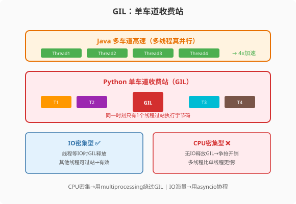

### 第13章 threading与GIL：单车道上的交通调度

> 📖 本章你将学会：
> - 理解GIL的释放时机与对CPU/IO任务的不同影响
> - 用threading.Lock/RLock/Semaphore替代Java synchronized/ReentrantLock
> - 识别GIL导致"多线程比单线程慢"的陷阱场景
> - 掌握threading的适用边界与替代方案

---



#### 第1节 GIL工作机制深度解析

##### 1.1.1 GIL的两条释放路径

第12章我们了解了GIL的基本概念。本章深入GIL的工作机制——理解它何时释放、何时不释放，是用好threading的前提。

GIL的释放有两条完全不同的路径[^gil-paths]：

**路径一：主动让渡（Voluntary Release）**

当线程执行到已知会阻塞的操作时，会在进入阻塞前主动释放GIL。这些操作包括：

```python
# 以下操作会触发GIL主动释放
import time
time.sleep(1)           # 睡眠

# 文件IO
with open("data.txt") as f:
    data = f.read()     # 阻塞式读取

# 网络IO
import requests
response = requests.get("https://example.com")  # 阻塞式请求

# 这些操作的共同点：线程在等待外部资源，期间不执行Python字节码
# 所以释放GIL不影响自己，但让其他线程可以执行
```

**路径二：被动剥夺（Preemptive Release）**

当线程持续执行Python字节码（CPU密集型），达到时间片上限时，解释器强制要求它释放GIL。Python 3.2+的默认时间片为5ms[^gil-switchinterval]。

```python
# 以下操作不会主动释放GIL，依赖时间片到期被动释放
def cpu_heavy():
    total = 0
    for i in range(10_000_000):  # 纯计算，无IO
        total += i
    return total
# GIL在这个循环中每5ms被动释放一次，让其他线程有机会执行
# 但"释放→争抢→重新获取"的开销让总时间比单线程更长
```

##### 1.1.2 CPU密集型：多线程比单线程慢的实验

这是Java程序员最震撼的Python并发实验——在Java里，CPU密集型多线程在多核CPU上能加速；在Python里，反而更慢。

```python
import threading
import time

def cpu_heavy():
    """CPU密集型任务：纯计算"""
    total = 0
    for i in range(10_000_000):
        total += i

# 实验一：单线程
start = time.time()
cpu_heavy()
single_time = time.time() - start
print(f"单线程: {single_time:.2f}s")  # ~3s

# 实验二：双线程
start = time.time()
t1 = threading.Thread(target=cpu_heavy)
t2 = threading.Thread(target=cpu_heavy)
t1.start(); t2.start()
t1.join(); t2.join()
dual_time = time.time() - start
print(f"双线程: {dual_time:.2f}s")  # ~4s（更慢！）

print(f"多线程减速: {dual_time/single_time:.1f}x")
# 输出：多线程减速: 1.3x（双线程比单线程慢30%）
```

**为什么更慢？** 双线程各自执行1000万次循环，但GIL让它们轮流执行。每次GIL切换（5ms一次）都有上下文切换开销——保存/恢复线程状态、操作系统调度、缓存失效。这些开销累积起来，超过了"看起来在并行"的错觉收益。

> ⚠️ **Java程序员的震撼**：在Java里，CPU密集型双线程在双核CPU上理论上2倍加速。在Python里，双线程反而比单线程慢——GIL争抢的上下文切换开销超过了并行收益。这不是Bug，是GIL架构的必然结果。

##### 1.1.3 IO密集型：多线程有效

同样是多线程，IO密集型任务却能获得加速——因为IO等待时GIL释放，其他线程可以执行。

```python
import threading
import requests
import time

def fetch_url(url):
    response = requests.get(url)
    return len(response.text)

urls = ["https://httpbin.org/delay/1"] * 10

# 单线程：串行请求
start = time.time()
for url in urls:
    fetch_url(url)
print(f"单线程10请求: {time.time()-start:.2f}s")  # ~10s

# 多线程：并发请求
start = time.time()
threads = [threading.Thread(target=fetch_url, args=(url,)) for url in urls]
for t in threads: t.start()
for t in threads: t.join()
print(f"10线程10请求: {time.time()-start:.2f}s")  # ~1.5s
```

**为什么有效？** `requests.get()`在等待网络响应时释放GIL。10个线程中，一个在等网络时，其他9个可以发起各自的请求。虽然同一时刻只有一个线程执行Python字节码，但10个网络请求几乎同时发出，总耗时接近单次请求时间。

---

#### 第2节 threading的同步原语 vs Java并发工具

##### 1.2.1 Lock vs synchronized

```java
// Java: synchronized块
private final Object lock = new Object();
synchronized (lock) {
    counter++;
}
// synchronized自动获取/释放锁，不会忘记释放
```

```python
# Python: threading.Lock + with语句
import threading
lock = threading.Lock()
with lock:
    counter += 1
# with语句等价于 lock.acquire(); try: ... finally: lock.release()
# 语义与Java synchronized完全一致
```

Python的`with lock`和Java的`synchronized`语义相同——获取锁、执行临界区、释放锁。但有一个关键区别：

| 特性 | Java synchronized | Python threading.Lock |
|------|-------------------|----------------------|
| 保护范围 | 对象监视器 | 任意代码段 |
| 可重入 | ✅（同一线程可多次获取） | ❌（Lock不可重入，会死锁） |
| 公平性 | 非公平 | 非公平 |
| 异常释放 | ✅（自动释放） | ✅（with语句保证释放） |

##### 1.2.2 RLock vs ReentrantLock

Java的`synchronized`是可重入的——同一线程可以多次获取同一把锁不会死锁。Python的`Lock`不可重入，如果同一线程二次获取会死锁。需要可重入锁时用`RLock`：

```python
import threading

# Lock：不可重入——同一线程二次获取会死锁
lock = threading.Lock()
lock.acquire()
# lock.acquire()  # 死锁！同一线程不能再次获取

# RLock：可重入——同一线程可多次获取，对应Java的ReentrantLock
rlock = threading.RLock()
rlock.acquire()
rlock.acquire()  # OK，计数器+1
rlock.release()
rlock.release()  # 计数器归零，锁释放
```

```java
// Java等价：ReentrantLock
ReentrantLock lock = new ReentrantLock();
lock.lock();
lock.lock();  // OK，可重入
lock.unlock();
lock.unlock();
```

##### 1.2.3 同步原语对照表

| Python | Java对应 | 用途 |
|--------|---------|------|
| `threading.Lock` | `synchronized`（简化版） | 基础互斥锁 |
| `threading.RLock` | `ReentrantLock` | 可重入锁 |
| `threading.Semaphore` | `Semaphore` | 限流（允许N个线程同时访问） |
| `threading.Event` | `CountDownLatch`（简化版） | 线程间事件通知 |
| `threading.Condition` | `Condition` | 条件变量（生产者-消费者） |
| `threading.Barrier` | `CyclicBarrier` | 多线程汇合点 |

##### 1.2.4 Semaphore实战：限流器

```python
import threading
import requests
import time

# 限制同时最多5个并发请求
semaphore = threading.Semaphore(5)

def fetch_with_limit(url):
    with semaphore:  # 获取许可（最多5个线程同时进入）
        response = requests.get(url)
        return response.status_code

# 100个URL，但同时只有5个在请求
urls = [f"https://httpbin.org/delay/1?i={i}" for i in range(100)]
threads = [threading.Thread(target=fetch_with_limit, args=(url,)) for url in urls]
for t in threads: t.start()
for t in threads: t.join()
```

> 💡 **Java对比**：Java中同样用`Semaphore`做限流，语义完全一致。Python的`with semaphore`等价于Java的`semaphore.acquire(); try { ... } finally { semaphore.release(); }`。

---

#### 第3节 threading的高级用法

##### 1.3.1 ThreadPoolExecutor：线程池

Java开发者熟悉的线程池在Python中也有——`concurrent.futures.ThreadPoolExecutor`[^threadpool-doc]：

```python
from concurrent.futures import ThreadPoolExecutor, as_completed
import requests

urls = [f"https://httpbin.org/delay/{i%3}" for i in range(50)]

# Python线程池——API与Java ThreadPoolExecutor非常相似
with ThreadPoolExecutor(max_workers=10) as executor:
    # 提交所有任务
    futures = {executor.submit(requests.get, url): url for url in urls}
    
    # 按完成顺序获取结果
    for future in as_completed(futures):
        url = futures[future]
        try:
            response = future.result()
            print(f"{url}: {response.status_code}")
        except Exception as e:
            print(f"{url} 失败: {e}")
```

```java
// Java等价写法
ExecutorService pool = Executors.newFixedThreadPool(10);
List<Future<HttpResponse>> futures = new ArrayList<>();
for (String url : urls) {
    futures.add(pool.submit(() -> client.send(url)));
}
for (Future<HttpResponse> f : futures) {
    try {
        HttpResponse resp = f.get();
        System.out.println(resp.statusCode());
    } catch (Exception e) {
        System.out.println("失败: " + e);
    }
}
pool.shutdown();
```

##### 1.3.2 生产者-消费者模式

```python
import threading
import queue
import time
import random

# 共享队列
task_queue = queue.Queue(maxsize=10)

def producer():
    """生产者：往队列放数据"""
    for i in range(20):
        item = f"task-{i}"
        task_queue.put(item)  # 队列满时阻塞
        print(f"生产: {item}")
        time.sleep(random.random() * 0.1)

def consumer(name):
    """消费者：从队列取数据"""
    while True:
        item = task_queue.get()  # 队列空时阻塞
        if item is None:  # 哨兵值，表示结束
            task_queue.put(None)  # 传递给其他消费者
            break
        print(f"  {name} 消费: {item}")
        task_queue.task_done()  # 标记任务完成
        time.sleep(random.random() * 0.2)

# 启动2个消费者
consumers = [threading.Thread(target=consumer, args=(f"C{i}",)) for i in range(2)]
for c in consumers: c.start()

# 启动生产者
producer()

# 发送结束信号
task_queue.put(None)
for c in consumers: c.join()
```

> 💡 **Java对比**：Python的`queue.Queue`对应Java的`BlockingQueue`，`put()`和`get()`都是阻塞操作。`task_done()`和`join()`的配合用于等待所有任务处理完毕，类似Java的`CountDownLatch`。

---

#### 第4节 GIL的边界：什么时候threading真的有用

经过前面的分析，threading的适用边界已经清晰：

| 场景 | threading是否有效 | 原因 |
|------|-----------------|------|
| HTTP请求（少量） | ✅ 有效 | IO等待时GIL释放 |
| 文件读写 | ✅ 有效 | IO等待时GIL释放 |
| 数据库查询 | ✅ 有效 | IO等待时GIL释放 |
| 纯数学计算 | ❌ 无效/更慢 | GIL阻止并行 |
| 图像处理（Pillow） | ✅ 有效 | C扩展在计算时释放GIL |
| NumPy矩阵运算 | ✅ 有效 | C扩展在计算时释放GIL |
| 调用C/C++库 | ✅ 有效 | C代码可释放GIL |

**关键洞察**：threading是否有效，取决于任务是"等IO"还是"算CPU"。等IO时GIL释放，threading有效；算CPU时GIL持有，threading无效。但如果CPU计算是在C扩展中进行的（如NumPy），C扩展可以主动释放GIL，此时threading也能并行。

```python
# NumPy运算——threading可以有效！
import numpy as np
import threading

def matrix_multiply(n):
    a = np.random.rand(n, n)
    b = np.random.rand(n, n)
    return a @ b  # NumPy的C实现在计算时释放GIL

# 多线程做矩阵乘法——可以真正并行
threads = [threading.Thread(target=matrix_multiply, args=(1000,)) for _ in range(4)]
for t in threads: t.start()
for t in threads: t.join()
# 4个线程可以并行执行，因为NumPy释放了GIL
```

---

#### 性能贴士

| 场景 | Java多线程 | Python threading | 倍数关系 |
|------|-----------|-----------------|---------|
| CPU密集4线程（纯Python） | 4x加速 | 0.7x（更慢） | — |
| CPU密集4线程（NumPy） | 4x加速 | ~3x加速 | 接近 |
| IO密集4线程 | 3x加速 | 3x加速 | 相当 |
| 10万并发IO | 需1MB×10万=100GB | 需8MB×10万=800GB | 都不行→用asyncio |

> ⚡ **结论**：Python threading只适合少量IO阻塞任务。CPU密集用multiprocessing，海量IO用asyncio。但如果CPU计算在C扩展中（如NumPy/Pillow），threading也能有效并行——因为C扩展释放了GIL。

---

#### 本章小结

GIL让Python threading在CPU密集型场景下不仅无法加速，还可能更慢。IO密集型场景下threading有效，但大量并发时不如asyncio高效。

Java程序员要记住三个要点：
1. **纯Python CPU计算** → 永远用multiprocessing，不用threading
2. **IO等待** → 少量用threading，海量用asyncio
3. **C扩展计算**（NumPy/Pillow）→ threading可以并行，因为C扩展释放GIL

threading的同步原语（Lock/RLock/Semaphore/Condition）与Java一一对应，迁移成本低。但`Lock`不可重入——需要可重入时用`RLock`。

---

[^gil-paths]: Python 官方文档, "Python 内部: GIL", https://devguide.python.org/internals/gil/ — GIL 在 I/O 操作时主动释放，在时间片到期时被动释放。

[^gil-switchinterval]: Python 3.2 What's New, "Multi-threading", https://docs.python.org/3/whatsnew/3.2.html#multi-threading — GIL 切换间隔默认 5ms，通过 sys.setswitchinterval() 调整。

[^threadpool-doc]: Python 官方文档, "concurrent.futures — Launching parallel tasks", https://docs.python.org/3/library/concurrent.futures.html — ThreadPoolExecutor 提供高层线程池 API。
