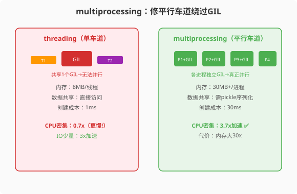

### 第14章 multiprocessing：修一条平行的高速公路

> 📖 本章你将学会：
> - 用multiprocessing绕过GIL实现真正的CPU并行
> - 理解fork/spawn/forkserver三种进程启动方式的差异
> - 使用Pool进程池和ProcessPoolExecutor管理并行任务
> - 掌握进程间通信（Queue/Pipe/SharedMemory）的代价与选择
> - 避免multiprocessing的常见陷阱（pickle序列化、僵尸进程）

---



#### 第1节 为什么multiprocessing能绕过GIL

##### 1.1.1 独立解释器，独立GIL

第12章我们了解到，GIL是CPython解释器级别的锁。`multiprocessing`的原理很简单——**每个进程有独立的Python解释器实例，每个实例有自己的GIL**。N个进程就有N个GIL，互不干扰，CPU密集型任务可以真正N倍加速。

```python
from multiprocessing import Pool
import time

def cpu_heavy(n):
    """CPU密集型任务"""
    total = 0
    for i in range(n):
        total += i
    return total

if __name__ == "__main__":
    numbers = [10_000_000] * 4

    # 单进程
    start = time.time()
    for n in numbers:
        cpu_heavy(n)
    single = time.time() - start
    print(f"单进程: {single:.2f}s")  # ~12s

    # 4进程并行
    start = time.time()
    with Pool(4) as pool:
        results = pool.map(cpu_heavy, numbers)
    multi = time.time() - start
    print(f"4进程: {multi:.2f}s")  # ~3s
    print(f"加速比: {single/multi:.1f}x")  # ~4x
```

> 💡 **比喻**：threading是在单车道上开4辆车轮流过站。multiprocessing是修4条平行车道，4辆车同时跑——真正的并行。代价是每条车道（进程）都要独立建设（30MB+内存）。

##### 1.1.2 代价：进程不是免费的

multiprocessing的并行不是没有代价：

| 指标 | threading | multiprocessing |
|------|-----------|----------------|
| 创建成本 | ~1ms | ~30ms（30倍） |
| 内存/单位 | 8MB | 30MB+（4倍） |
| 数据传递 | 直接共享内存 | 需pickle序列化 |
| 通信延迟 | 纳秒级 | 毫秒级 |

进程创建慢30倍，内存大4倍，数据传递需要序列化——这些代价决定了multiprocessing适合"启动一次、长期运行"的CPU密集场景，不适合频繁创建销毁的短任务。

---

#### 第2节 三种进程启动方式

`multiprocessing`支持三种进程启动方式，不同平台的默认值不同[^start-methods]。这是Java开发者容易忽略的细节——Java的线程模型在所有平台上行为一致，但Python的进程模型有平台差异。

##### 1.2.1 fork vs spawn vs forkserver

| 启动方式 | 原理 | 默认平台 | 优点 | 缺点 |
|---------|------|---------|------|------|
| **fork** | `os.fork()`复制父进程 | Linux（3.14前） | 快，继承父进程状态 | 多线程fork不安全 |
| **spawn** | 重新启动Python解释器 | Windows/macOS | 安全，干净 | 慢，需重新导入 |
| **forkserver** | fork服务器fork新进程 | POSIX（3.14+默认） | 安全且较快 | 需Unix管道支持 |

**关键变更**[^fork-deprecation]：
- Python 3.8：macOS默认从fork改为spawn（因fork多线程进程不安全，bpo-33725）
- Python 3.12：多线程fork触发`DeprecationWarning`
- Python 3.14：POSIX默认从fork改为forkserver

##### 1.2.2 spawn的特殊要求

spawn模式会重新启动Python解释器，子进程需要重新导入主模块。这带来一个重要约束——**主模块的代码必须用`if __name__ == "__main__":`保护**：

```python
# ❌ 错误写法——spawn模式下子进程会重复执行
from multiprocessing import Pool

def worker(x):
    return x * x

pool = Pool(4)
results = pool.map(worker, range(10))
# spawn模式下：子进程导入此模块时，会再次执行Pool(4)，导致无限递归！

# ✅ 正确写法——用__name__守卫
if __name__ == "__main__":
    pool = Pool(4)
    results = pool.map(worker, range(10))
    pool.close()
    pool.join()
```

> ⚠️ **Java老兵注意**：Java没有这个约束——JVM线程共享同一进程空间，不需要"守卫"。但Python在spawn模式下，子进程是全新的解释器实例，会重新执行模块顶层代码。`if __name__ == "__main__":`是Python多进程编程的**必备习惯**。

##### 1.2.3 显式选择启动方式

```python
import multiprocessing as mp

# 方法一：全局设置（在__main__中调用一次）
if __name__ == "__main__":
    mp.set_start_method('spawn')  # 或 'fork' / 'forkserver'
    
# 方法二：获取上下文（推荐，不影响全局）
ctx = mp.get_context('spawn')
pool = ctx.Pool(4)
```

> 💡 **建议**：用`get_context()`而非`set_start_method()`——前者只影响当前代码，不会干扰其他库的行为。

---

#### 第3节 进程池：Pool与ProcessPoolExecutor

##### 1.3.1 Pool：经典进程池

```python
from multiprocessing import Pool
import time

def process_data(chunk):
    """处理数据块"""
    result = sum(x * x for x in chunk)
    return result

if __name__ == "__main__":
    # 准备数据：4个数据块
    data_chunks = [range(0, 2500000), range(2500000, 5000000),
                   range(5000000, 7500000), range(7500000, 10000000)]
    
    # 创建4进程池
    with Pool(4) as pool:
        # map：有序，等所有完成
        results = pool.map(process_data, data_chunks)
        print(f"map结果: {results}")
        
        # imap：有序，但逐个返回（适合流式处理）
        for result in pool.imap(process_data, data_chunks):
            print(f"imap中间结果: {result}")
        
        # map_async：异步，不阻塞主进程
        result_async = pool.map_async(process_data, data_chunks)
        # 可以在这里做其他事情
        results = result_async.get()  # 阻塞等待结果
```

##### 1.3.2 ProcessPoolExecutor：现代API

`concurrent.futures.ProcessPoolExecutor`是更现代的API，与`ThreadPoolExecutor`接口一致[^processpoolexecutor]：

```python
from concurrent.futures import ProcessPoolExecutor, as_completed
import time

def cpu_task(n):
    total = 0
    for i in range(n):
        total += i
    return total

if __name__ == "__main__":
    tasks = [5_000_000, 5_000_000, 5_000_000, 5_000_000]
    
    with ProcessPoolExecutor(max_workers=4) as executor:
        # 提交所有任务
        futures = {executor.submit(cpu_task, n): n for n in tasks}
        
        # 按完成顺序获取结果
        for future in as_completed(futures):
            n = futures[future]
            result = future.result()
            print(f"任务 n={n} 完成，结果={result}")
```

| 特性 | multiprocessing.Pool | ProcessPoolExecutor |
|------|---------------------|-------------------|
| API风格 | 函数式（map/apply） | Future对象 |
| 结果获取 | 阻塞或回调 | as_completed迭代 |
| 异常处理 | 需检查返回值 | future.exception() |
| 推荐度 | 经典，兼容性好 | 现代，与线程池API统一 |

> 💡 **Java对比**：`ProcessPoolExecutor`的API与Java的`CompletableFuture`+`ExecutorService`非常相似。如果你熟悉Java的`Future.get()`和`CompletableFuture.thenApply()`，迁移到Python的`Future.result()`几乎零成本。

---

#### 第4节 进程间通信（IPC）

进程不共享内存，数据传递需要序列化（pickle）——这是multiprocessing的主要开销，也是与threading最大的区别。

##### 1.4.1 四种IPC方式

| IPC方式 | 用途 | Java对应 | 延迟 | 适用场景 |
|---------|------|---------|------|---------|
| `Queue` | 进程间传消息 | `BlockingQueue` | 中 | 生产者-消费者 |
| `Pipe` | 双向管道 | `PipedInputStream/OutputStream` | 低 | 父子进程通信 |
| `SharedMemory` | 共享内存 | `ByteBuffer`/`MappedByteBuffer` | 极低 | 大数据共享 |
| `Manager` | 代理共享对象 | 无直接对应 | 高 | 复杂共享状态 |

##### 1.4.2 Queue：进程安全队列

```python
from multiprocessing import Process, Queue

def producer(q):
    for i in range(10):
        q.put(f"产品-{i}")
    q.put(None)  # 哨兵，表示结束

def consumer(q):
    while True:
        item = q.get()
        if item is None:
            break
        print(f"消费: {item}")

if __name__ == "__main__":
    q = Queue()
    p = Process(target=producer, args=(q,))
    c = Process(target=consumer, args=(q,))
    p.start()
    c.start()
    p.join()
    c.join()
```

> 💡 **Java对比**：Python的`multiprocessing.Queue`与Java的`java.util.concurrent.LinkedBlockingQueue`语义一致——`put()`和`get()`都是阻塞操作。区别是Python的`Queue`跨进程，数据需要pickle序列化。

##### 1.4.3 Pipe：高性能双向通信

```python
from multiprocessing import Process, Pipe

def worker(conn):
    # 子进程端
    data = conn.recv()  # 接收数据
    print(f"子进程收到: {data}")
    conn.send("处理完成")  # 发送结果
    conn.close()

if __name__ == "__main__":
    # Pipe返回两个Connection对象
    parent_conn, child_conn = Pipe()
    
    p = Process(target=worker, args=(child_conn,))
    p.start()
    
    parent_conn.send("你好，子进程")  # 父进程发送
    result = parent_conn.recv()       # 父进程接收
    print(f"父进程收到: {result}")
    
    p.join()
```

**Pipe vs Queue**：Pipe是双向的、点对点的，性能更高。Queue是单向的、多生产者多消费者的，功能更全。如果只有父子两个进程通信，用Pipe更高效。

##### 1.4.4 SharedMemory：零拷贝共享

Python 3.8引入了`multiprocessing.shared_memory`模块[^shared-memory]，允许进程间共享内存而无需序列化：

```python
from multiprocessing import Process
from multiprocessing import shared_memory
import numpy as np

def worker(shm_name, shape):
    # 子进程：连接到共享内存
    shm = shared_memory.SharedMemory(name=shm_name)
    arr = np.ndarray(shape, dtype=np.float64, buffer=shm.buf)
    # 直接操作共享内存中的数组——无需拷贝！
    arr *= 2
    shm.close()

if __name__ == "__main__":
    # 父进程：创建共享内存
    data = np.ones((1000, 1000), dtype=np.float64)
    shm = shared_memory.SharedMemory(create=True, size=data.nbytes)
    
    # 将数据放入共享内存
    shared_arr = np.ndarray(data.shape, dtype=data.dtype, buffer=shm.buf)
    shared_arr[:] = data[:]
    
    # 启动子进程
    p = Process(target=worker, args=(shm.name, data.shape))
    p.start()
    p.join()
    
    # 验证结果
    print(f"共享内存中的值: {shared_arr[0, 0]}")  # 2.0（被子进程翻倍）
    
    # 清理
    shm.close()
    shm.unlink()  # 释放共享内存
```

> ⚡ **性能优势**：SharedMemory避免了pickle序列化开销。传递一个1000×1000的float64数组，Queue需要~8MB的pickle拷贝，SharedMemory只需共享一个内存地址——几乎零成本。

---

#### 第5节 常见陷阱与解决方案

##### 1.5.1 pickle限制：不能序列化的对象

multiprocessing通过pickle传递数据，但并非所有对象都能pickle[^pickle-limit]：

```python
from multiprocessing import Pool

# ❌ 不能pickle的对象
class BadWorker:
    def __call__(self, x):
        return x * 2

# 以下代码会报错：Can't pickle local object
# pool.map(BadWorker(), range(10))

# ✅ 解决方案一：用顶层函数
def good_worker(x):
    return x * 2

if __name__ == "__main__":
    with Pool(4) as pool:
        results = pool.map(good_worker, range(10))

# ✅ 解决方案二：用偏函数传递参数
from functools import partial

def process_with_config(x, multiplier):
    return x * multiplier

if __name__ == "__main__":
    worker = partial(process_with_config, multiplier=3)
    with Pool(4) as pool:
        results = pool.map(worker, range(10))
```

##### 1.5.2 僵尸进程

子进程异常退出但未被`join()`会导致僵尸进程：

```python
from multiprocessing import Process
import os
import signal

def worker():
    raise RuntimeError("子进程崩溃")

if __name__ == "__main__":
    p = Process(target=worker)
    p.start()
    # 如果不调用p.join()，子进程变成僵尸进程
    
    # ✅ 正确做法：用try-finally确保join
    try:
        p.start()
        # ... 主进程逻辑
    finally:
        p.join(timeout=5)  # 等5秒
        if p.is_alive():
            p.terminate()  # 强制终止
            p.join()
```

##### 1.5.3 macOS上的spawn陷阱

macOS默认使用spawn，子进程会重新导入主模块。如果你的模块顶层有副作用代码（如连接数据库、创建窗口），子进程会重复执行：

```python
# ❌ macOS上的问题
from multiprocessing import Pool
import pymysql

conn = pymysql.connect(...)  # 顶层连接数据库

def query(sql):
    return conn.query(sql)  # 使用全局conn

if __name__ == "__main__":
    # spawn模式下，子进程会重新执行pymysql.connect()
    # 而且conn在子进程中是新的连接，可能配置不对
    with Pool(4) as pool:
        pool.map(query, ["SELECT 1"] * 4)

# ✅ 解决方案：在worker函数内创建连接
def query(sql):
    conn = pymysql.connect(...)  # 每次在子进程内创建
    try:
        return conn.query(sql)
    finally:
        conn.close()
```

---

#### 性能贴士

| 指标 | Java Thread | Python Thread | Python Process |
|------|-----------|--------------|---------------|
| 创建成本 | 1ms | 1ms | 30ms |
| 内存/单位 | 1MB | 8MB | 30MB+ |
| 数据传递 | 直接共享 | 直接共享 | 需pickle序列化 |
| CPU并行 | ✅ | ❌(GIL) | ✅ |
| 跨平台一致性 | ✅ | ✅ | ⚠️(启动方式不同) |

> ⚡ **multiprocessing的代价**：进程创建慢30倍，内存大4-30倍，数据传递需序列化。适合"启动一次、长期运行"的CPU密集场景。用Pool进程池管理可摊薄创建成本。避免频繁创建销毁短任务进程——用Pool的`maxtasksperchild`控制进程生命周期。

---

#### 本章小结

multiprocessing是Python绕过GIL的唯一方案（CPU密集型）。每个进程有独立的GIL，N个进程在N核CPU上可以真正N倍加速。

核心要点：
1. **用Pool进程池**而非手动创建Process——摊薄30ms的创建成本
2. **注意启动方式**——macOS用spawn，Linux用fork（3.14改forkserver），spawn需要`if __name__ == "__main__":`守卫
3. **IPC选择**——简单消息用Queue，双向通信用Pipe，大数据用SharedMemory
4. **pickle限制**——不能序列化lambda、嵌套函数、数据库连接等，需用顶层函数+partial
5. **资源清理**——用`with`语句或try-finally确保进程被join，避免僵尸进程

multiprocessing的代价是进程创建成本高、内存占用大、数据传递需序列化。但CPU密集型任务没有更好的选择——threading被GIL锁死，asyncio是单线程的。

下一章，我们讲asyncio——Python IO并发的终极武器。

---

[^start-methods]: Python 官方文档, "multiprocessing — Contexts and start methods", https://docs.python.org/3/library/multiprocessing.html#contexts-and-start-methods — 三种启动方式：fork、spawn、forkserver，平台默认值不同。

[^fork-deprecation]: Python 3.12 What's New & bpo-33725 — macOS 自 3.8 起默认 spawn；Python 3.12 对多线程 fork 发出 DeprecationWarning；Python 3.14 POSIX 默认从 fork 改为 forkserver。

[^processpoolexecutor]: Python 官方文档, "concurrent.futures — ProcessPoolExecutor", https://docs.python.org/3/library/concurrent.futures.html#processpoolexecutor — 现代 Future 风格进程池 API。

[^shared-memory]: Python 官方文档, "multiprocessing.shared_memory — Shared memory for parallel processing", Python 3.8 新增, https://docs.python.org/3/library/multiprocessing.shared_memory.html — 提供跨进程共享内存段，避免 pickle 序列化开销。

[^pickle-limit]: Python 官方文档, "pickle — What can be pickled and unpickled?", https://docs.python.org/3/library/pickle.html#what-can-be-pickled-and-unpickled — lambda、嵌套函数、数据库连接等不可 pickle。
