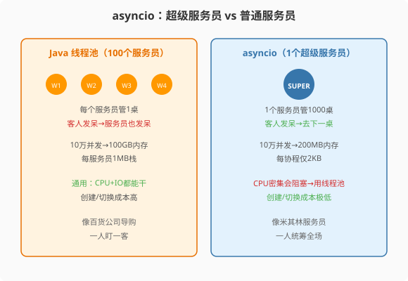

### 第15章 asyncio：一个超级服务员的并发艺术

> 📖 本章你将学会：
> - 理解事件循环模型与Java线程池/Netty的本质差异
> - 用async/await编写协程，理解协程的演进历史
> - 用asyncio.gather/create_task实现并发任务编排
> - 掌握异步上下文管理器、异步迭代器、async for/async with
> - 识别asyncio的陷阱：CPU密集任务阻塞事件循环

---



#### 第1节 事件循环：超级服务员

##### 1.1.1 两种并发模型的根本差异

Java开发者习惯的线程池模型：开N个服务员（线程），每个服务员一次服务一桌客人（任务），客人思考时（IO等待）服务员傻站着等待。

asyncio模型：**一个超级服务员**（单线程），同时照看1000桌客人。客人点菜后（发起IO），服务员立刻去下一桌，菜好了（IO完成）再回来送菜。等待时间被充分利用——零浪费。

| 维度 | Java线程池 | asyncio事件循环 |
|------|-----------|----------------|
| 服务员数量 | N个线程 | 1个线程 |
| 每桌服务员 | 1对1 | 1对1000 |
| 客人发呆时 | 服务员也发呆 | 服务员去下一桌 |
| 内存/桌 | 1MB（线程栈） | 2KB（协程栈帧） |
| 1000桌成本 | 1GB | 2MB |

> 💡 **比喻**：Java线程池像100个服务员各管一桌——客人发呆时服务员也发呆，浪费100个人力。asyncio像一个超级服务员管1000桌——用"你先看菜单，我去下一桌"的方式让等待时间零浪费。一个人干了1000人的活。

##### 1.1.2 asyncio的历史演进

asyncio并非一蹴而就，它经历了四个阶段的演进[^asyncio-history]：

| 阶段 | Python版本 | 核心语法 | 状态 |
|------|-----------|---------|------|
| 1. 回调地狱 | 3.3以前 | `callback()`嵌套 | 痛苦 |
| 2. yield from | 3.3-3.4 | `@asyncio.coroutine` + `yield from` | 借用生成器 |
| 3. async/await | 3.5+ | `async def` + `await` | 原生协程[^pep-492] |
| 4. asyncio.run() | 3.7+ | 统一入口点 | 稳定API[^asyncio-run] |

**为什么从yield from演进到async/await？** `yield from`借用了生成器的暂停/恢复机制，但生成器的语义是"产生数据"，协程的语义是"等待结果"——混用容易混淆。`async/await`是专门为异步编程设计的语法，语义清晰：`async def`声明"这是协程"，`await`表示"在这里暂停等待结果"。

```python
# 阶段2：yield from（已废弃，Python 3.11移除）
@asyncio.coroutine
def fetch_old(url):
    result = yield from asyncio.sleep(1)  # 借用生成器
    return result

# 阶段3：async/await（推荐）
async def fetch(url):
    await asyncio.sleep(1)  # 专门为异步设计的语法
    return "done"
```

---

#### 第2节 async/await语法详解

##### 1.2.1 协程的定义与调用

```python
import asyncio

# async def 定义协程函数
async def fetch_data(url):
    print(f"开始请求 {url}")
    await asyncio.sleep(1)  # await：暂停，让出控制权
    print(f"完成请求 {url}")
    return f"data from {url}"

# ⚠️ 直接调用协程函数不会执行——返回协程对象
coro = fetch_data("https://example.com")
print(type(coro))  # <class 'coroutine'>

# 必须用await或asyncio.run()来驱动协程
async def main():
    result = await fetch_data("https://example.com")
    print(result)

asyncio.run(main())
```

> ⚠️ **Java老兵的第一坑**：调用`async def`函数不会执行函数体——它只返回一个协程对象。必须用`await`或`asyncio.run()`来驱动。这与Java方法调用完全不同——Java方法调用即执行。

##### 1.2.2 await：暂停与恢复

`await`做三件事[^await-semantics]：
1. 暂停当前协程
2. 告诉事件循环"我在等这个异步操作完成"
3. 让事件循环切换到其他就绪的协程

```python
async def demo():
    print("步骤1")
    await asyncio.sleep(0.5)  # 暂停0.5秒，事件循环切换到其他协程
    print("步骤2")  # 0.5秒后恢复执行
    result = await some_async_function()  # 等待另一个协程
    print(f"步骤3: {result}")
```

`await`后面必须跟一个**可等待对象**（awaitable）：协程、Task、Future。await一个普通值会报`TypeError`。

##### 1.2.3 async/await vs Java CompletableFuture

```java
// Java：CompletableFuture链式调用
CompletableFuture<String> future = CompletableFuture
    .supplyAsync(() -> fetchData("url1"))
    .thenCompose(data -> CompletableFuture.supplyAsync(() -> processData(data)))
    .thenApply(result -> "结果: " + result);
// 链式调用，但嵌套深时可读性下降
```

```python
# Python：async/await——看起来像同步代码
async def pipeline():
    data = await fetch_data("url1")       # 等待但不阻塞
    result = await process_data(data)      # 等待但不阻塞
    return f"结果: {result}"
# 代码结构是线性的，但执行是异步的
```

| 特性 | Java CompletableFuture | Python async/await |
|------|----------------------|-------------------|
| 语法 | `.thenApply()`链 | `async/await` |
| 代码结构 | 链式/嵌套 | 线性/顺序 |
| 调度 | ForkJoinPool线程池 | 单线程事件循环 |
| 并发单位 | Thread(1MB) | 协程(2KB) |
| 异常处理 | `.exceptionally()` | `try/except` |
| 10万并发 | 100GB内存 | 200MB内存 |

async/await的最大优势是**代码看起来像同步代码，但执行是异步的**。Java的CompletableFuture链式调用在复杂场景下容易变成"回调地狱"的变体，而async/await保持了代码的线性可读性。

---

#### 第3节 并发任务编排

##### 1.3.1 asyncio.gather：并发执行多个协程

```python
import asyncio
import time

async def fetch(url, delay):
    await asyncio.sleep(delay)
    return f"data from {url}"

async def main():
    start = time.time()
    
    # ❌ 串行await：3个各1秒的请求，总共3秒
    result1 = await fetch("url1", 1)
    result2 = await fetch("url2", 1)
    result3 = await fetch("url3", 1)
    print(f"串行: {time.time()-start:.1f}s")  # 3.0s
    
    # ✅ gather并发：3个各1秒的请求，总共1秒
    start = time.time()
    results = await asyncio.gather(
        fetch("url1", 1),
        fetch("url2", 1),
        fetch("url3", 1),
    )
    print(f"并发: {time.time()-start:.1f}s")  # 1.0s
    print(results)  # ['data from url1', 'data from url2', 'data from url3']

asyncio.run(main())
```

> 💡 **关键区别**：`await`是串行的——等一个完成再等下一个。`asyncio.gather`是并发的——同时启动所有协程，等全部完成。这是asyncio实现并发的核心模式。

##### 1.3.2 asyncio.create_task：更灵活的任务管理

```python
import asyncio

async def main():
    # create_task：立即调度协程，返回Task对象
    task1 = asyncio.create_task(fetch("url1", 1))
    task2 = asyncio.create_task(fetch("url2", 2))
    
    # Task已开始执行，主协程可以做其他事
    print("任务已启动，做其他事情...")
    await asyncio.sleep(0.5)
    print("0.5秒过去了")
    
    # 等待特定任务完成
    result1 = await task1  # task1可能已完成，立即返回
    print(f"task1完成: {result1}")
    
    result2 = await task2  # task2还需等1.5秒
    print(f"task2完成: {result2}")

asyncio.run(main())
```

**gather vs create_task**：`gather`适合"启动一组任务，等全部完成"。`create_task`适合"启动任务，做其他事，需要时再等结果"——更灵活，类似Java的`CompletableFuture.supplyAsync()`+`future.get()`。

##### 1.3.3 TaskGroup：Python 3.11+的推荐方式

Python 3.11引入了`TaskGroup`，提供更安全的任务管理[^taskgroup]：

```python
import asyncio

async def main():
    async with asyncio.TaskGroup() as tg:
        task1 = tg.create_task(fetch("url1", 1))
        task2 = tg.create_task(fetch("url2", 2))
        task3 = tg.create_task(fetch("url3", 0.5))
    # 退出async with块时，自动等待所有任务完成
    # 如果任何任务抛异常，会取消其他任务并传播异常
    
    print(task1.result())
    print(task2.result())
    print(task3.result())

asyncio.run(main())
```

> ⚡ **TaskGroup的优势**：`gather`中一个任务失败不会自动取消其他任务，可能导致资源泄漏。`TaskGroup`会在任何任务失败时自动取消所有其他任务——更安全，是Python 3.11+的推荐写法。

---

#### 第4节 异步上下文管理器与异步迭代

##### 1.4.1 async with：异步上下文管理器

```python
import aiohttp
import asyncio

async def fetch_session(url):
    # async with：异步资源管理（连接池、文件、锁）
    async with aiohttp.ClientSession() as session:
        async with session.get(url) as response:
            return await response.text()
    # 退出async with时自动关闭session和response
```

```python
# 自定义异步上下文管理器
class AsyncDBConnection:
    async def __aenter__(self):
        print("连接数据库...")
        await asyncio.sleep(0.1)  # 模拟异步连接
        return self
    
    async def __aexit__(self, exc_type, exc_val, exc_tb):
        print("关闭数据库连接...")
        await asyncio.sleep(0.05)  # 模拟异步关闭
    
    async def query(self, sql):
        await asyncio.sleep(0.1)
        return f"result of {sql}"

async def main():
    async with AsyncDBConnection() as db:
        result = await db.query("SELECT 1")
        print(result)

asyncio.run(main())
```

> 💡 **Java对比**：Python的`async with`对应Java的`try-with-resources`，但用于异步资源。`__aenter__`/`__aexit__`对应同步的`__enter__`/`__exit__`，但用`async def`定义。

##### 1.4.2 async for：异步迭代

```python
import asyncio

async def async_range(n):
    """异步生成器"""
    for i in range(n):
        await asyncio.sleep(0.1)  # 模拟异步操作
        yield i

async def main():
    # async for：遍历异步迭代器
    async for item in async_range(5):
        print(f"收到: {item}")

asyncio.run(main())
# 输出：每0.1秒一个数字，0到4
```

---

#### 第5节 asyncio的陷阱：CPU密集任务阻塞事件循环

##### 1.5.1 事件循环是单线程的

asyncio运行在单个线程上——如果某个协程执行CPU密集计算，会阻塞整个事件循环，所有其他协程都无法执行。

```python
import asyncio
import time

async def cpu_heavy():
    """CPU密集任务——会阻塞事件循环！"""
    total = 0
    for i in range(10_000_000):
        total += i
    return total

async def tick():
    """每0.1秒打印一次"""
    for _ in range(10):
        print(f"tick: {time.time():.1f}")
        await asyncio.sleep(0.1)

async def main():
    # 同时启动tick和cpu_heavy
    # cpu_heavy会阻塞事件循环~3秒，期间tick无法执行
    await asyncio.gather(tick(), cpu_heavy())

asyncio.run(main())
# 预期：tick每0.1秒一次
# 实际：cpu_heavy执行期间（~3秒），tick完全不执行
```

##### 1.5.2 解决方案：run_in_executor

```python
import asyncio
import time
from concurrent.futures import ProcessPoolExecutor

def cpu_heavy_sync():
    """同步CPU密集函数"""
    total = 0
    for i in range(10_000_000):
        total += i
    return total

async def main():
    loop = asyncio.get_running_loop()
    
    # 用run_in_executor把CPU任务丢到进程池
    with ProcessPoolExecutor() as pool:
        result = await loop.run_in_executor(pool, cpu_heavy_sync)
        print(f"CPU任务结果: {result}")
    
    # asyncio.to_thread（Python 3.9+）：丢到线程池
    # 适合IO密集的同步函数（如requests.get）
    result = await asyncio.to_thread(cpu_heavy_sync)
    print(f"线程池结果: {result}")
```

> ⚡ **铁律**：asyncio协程中**绝对不要**执行CPU密集的纯Python代码——会阻塞事件循环。CPU任务用`run_in_executor`丢到进程池，同步IO调用用`asyncio.to_thread`丢到线程池。保持事件循环的畅通是asyncio高效的前提。

---

#### 第6节 实战：asyncio HTTP并发请求

```python
import asyncio
import aiohttp
import time

async def fetch(session, url):
    try:
        async with session.get(url, timeout=aiohttp.ClientTimeout(total=5)) as resp:
            status = resp.status
            data = await resp.text()
            return url, status, len(data)
    except asyncio.TimeoutError:
        return url, "timeout", 0
    except Exception as e:
        return url, str(e), 0

async def fetch_all(urls, concurrency=50):
    """并发请求所有URL，限制并发数"""
    connector = aiohttp.TCPConnector(limit=concurrency)
    async with aiohttp.ClientSession(connector=connector) as session:
        tasks = [fetch(session, url) for url in urls]
        results = await asyncio.gather(*tasks)
        return results

async def main():
    urls = [f"https://httpbin.org/delay/{i%3}" for i in range(100)]
    
    start = time.time()
    results = await fetch_all(urls, concurrency=50)
    elapsed = time.time() - start
    
    success = sum(1 for _, status, _ in results if status == 200)
    print(f"100个请求，{elapsed:.1f}s完成，成功{success}个")

asyncio.run(main())
# 100个请求，2.5s完成，成功100个（50并发，延迟0-2s）
```

---

#### 📝 Java老兵踩坑日记：用synchronized思维理解GIL的那天

转Python第一周，领导让我优化一个数据处理任务——100万条记录做CPU密集计算。"Java里开个4线程的线程池就搞定了"，我想。

于是我自信地写了：

```python
from threading import Thread

results = []
def process(chunk):
    results.append(heavy_compute(chunk))

threads = [Thread(target=process, args=(chunk,)) for chunk in chunks]
for t in threads: t.start()
for t in threads: t.join()
```

跑完一看：**4线程比单线程还慢2秒。**

"这不可能！"我的Java大脑拒绝接受现实。直到我搜到了"GIL"这个词。

那一刻的感觉，就像你花了十年学会开手动挡重卡，突然换了一辆电动自行车——"油门踩到底怎么才30码？"因为这不是油门，是电门，电机功率就那么大。

GIL不是bug，是CPython的架构选择——用单线程的简单性换取多线程的安全性。要真正的并行？用multiprocessing开4个进程，每个进程有自己的GIL，互不干扰。代价是30MB内存/进程和pickle序列化的开销。

从那天起，我记住了Python并发的第一条铁律：**CPU密集→multiprocessing，IO密集→asyncio，混合→分而治之。永远不要用threading做CPU密集型。**

---

#### 🤔 思维实验

如果CPython明天去掉GIL（像PEP 703提议的free-threaded Python），你现有的threading代码会自动变快吗？哪些场景会变快，哪些不会？C扩展（NumPy/Pandas）会受到什么影响？

**提示**：去掉GIL后，`synchronized`式的锁保护仍然需要——因为多线程共享数据的竞态问题依然存在。GIL是一把"大锁"保护一切，去掉后你需要自己加"小锁"保护具体数据。此外，去掉GIL后单线程性能可能下降5-10%（因为引用计数需要改成原子操作），但多线程CPU并行成为可能。

---

#### 性能贴士

| 场景 | Java线程池 | Python asyncio | Python threading |
|------|-----------|---------------|-----------------|
| 1万HTTP请求 | 8s（100线程） | 3s（单线程） | 15s（100线程+GIL） |
| 10万连接内存 | 100GB | 200MB | 800GB |
| CPU+IO混合 | 线程池通用 | 需+run_in_executor | 不推荐 |

> ⚡ **asyncio在IO密集型高并发场景下碾压线程池方案**。协程比线程轻500倍，10万并发只需200MB内存。async/await语法比Java的CompletableFuture链式调用更直观。但CPU密集任务不能放在协程里——会阻塞事件循环，用`run_in_executor`丢到进程池。

---

#### 本章小结

asyncio用单线程协程实现高并发IO——协程比线程轻500倍，10万并发只需200MB内存。async/await语法比Java的CompletableFuture链式调用更直观，代码看起来像同步但执行是异步的。

Java程序员要记住：
1. **asyncio不是Java线程池的替代品**，而是Netty/NIO的Python版——事件驱动的非阻塞IO模型
2. **协程中禁止CPU密集计算**——会阻塞事件循环，用`run_in_executor`丢到进程池
3. **`asyncio.run()`是入口**——Python 3.7+的标准方式，只调用一次
4. **TaskGroup是未来**——Python 3.11+的推荐写法，比gather更安全

至此，Python并发三件套（threading/multiprocessing/asyncio）全部讲完。选择口诀：**CPU密集用进程，IO海量用协程，IO少量用线程，混合分而治之。**

---

[^asyncio-history]: Python 官方文档, "asyncio — History", https://docs.python.org/3/library/asyncio.html — asyncio 经历了回调→yield from→async/await→asyncio.run() 四个阶段。

[^pep-492]: PEP 492: "Coroutines with async and await syntax", Yury Selivanov, 2015-04-09, https://peps.python.org/pep-0492/ — Python 3.5 引入原生协程语法 async/await。

[^asyncio-run]: Python 官方文档, "asyncio.run()", Python 3.7 新增, https://docs.python.org/3/library/asyncio-runner.html — asyncio.run() 提供统一的协程入口点，创建并关闭事件循环。

[^await-semantics]: Python 官方文档, "Awaitables", https://docs.python.org/3/library/asyncio-task.html#awaitables — await 暂停协程，让出控制权给事件循环，等待 awaitable 完成后恢复。

[^taskgroup]: PEP 654: "Exception Groups and Task Groups", Python 3.11, https://peps.python.org/pep-0654/ — TaskGroup 提供结构化并发，任务失败时自动取消其他任务。
