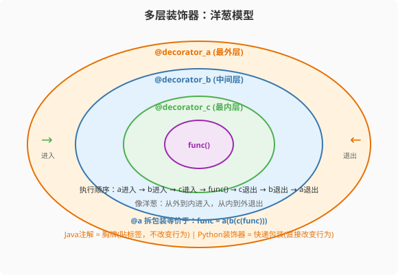

### 第10章 装饰器：从胸牌到快递包装服务

> 📖 本章你将学会：
> - 理解Python装饰器与Java注解的本质差异
> - 编写函数装饰器（计时/缓存/日志）
> - 理解多层装饰器的洋葱模型执行顺序
> - 用functools.wraps保持装饰器礼仪

---

#### 第1节 注解 vs 装饰器：胸牌 vs 快递包装

##### 10.1.1 开篇：两种`@`的含义

Java的`@`是**注解**——给代码贴一个标签，告诉框架"我是谁"。
注解本身不改变代码行为，由框架在运行时通过反射读取并处理。

```java
// Java: @Autowired是注解——告诉Spring"请注入"
@Service
public class UserService {
    @Autowired
    private UserRepository repository;  // Spring读取注解，注入依赖
}
```

Python的`@`是**装饰器**——一个高阶函数，直接包装被装饰函数，
改变其行为。不需要框架，不需要反射，装饰器自己就是执行逻辑。

```python
# Python: @cache是装饰器——直接改变函数行为
@functools.cache
def fib(n):
    return n if n < 2 else fib(n-1) + fib(n-2)

# 等价于：fib = functools.cache(fib)
# fib被包装后，自动缓存结果
```

> 💡 比喻：Java注解像胸牌——贴上"@Service"标签，Spring看到标签
> 才安排工作。Python装饰器像快递包装服务——你的包裹（函数）被
> 包了一层（缓存逻辑），寄出去时包装自动工作，不需要快递公司
> （框架）参与。

---

#### 第2节 编写装饰器

##### 10.2.1 计时装饰器

```python
import time
from functools import wraps

def timer(func):
    @wraps(func)  # 保持原函数的__name__等属性
    def wrapper(*args, **kwargs):
        start = time.perf_counter()
        result = func(*args, **kwargs)
        elapsed = time.perf_counter() - start
        print(f"{func.__name__}: {elapsed:.3f}s")
        return result
    return wrapper

@timer
def slow_function():
    time.sleep(1)

slow_function()  # slow_function: 1.001s
```

---



##### 10.2.2 多层装饰器：洋葱模型

```python
@decorator_a  # 最外层
@decorator_b  # 中间层
@decorator_c  # 最内层
def func():
    pass

# 等价于：func = decorator_a(decorator_b(decorator_c(func)))
# 执行时：a进入 → b进入 → c进入 → func执行 → c退出 → b退出 → a退出
```

像洋葱——从外到内进入，从内到外退出。

---

#### 第3节 常用内置装饰器

| 装饰器 | 作用 | Java对应 |
|--------|------|---------|
| `@staticmethod` | 静态方法 | `static`方法 |
| `@classmethod` | 类方法（第一个参数是类） | 无直接对应 |
| `@property` | 属性访问 | getter |
| `@functools.cache` | 自动缓存 | 无标准库对应 |
| `@dataclass` | 自动生成`__init__`/`__repr__` | Lombok `@Data` |

```python
from dataclasses import dataclass

@dataclass
class User:
    name: str
    age: int = 0
    # 自动生成 __init__, __repr__, __eq__

user = User("Alice", 30)  # 不用写__init__
```

> 💡 `@dataclass`是Python版的Lombok `@Data`——一行装饰器省去
> 构造函数、toString、equals的样板代码。

---

#### 第4节 性能贴士

| 操作 | 无装饰器 | 有装饰器 | 开销 |
|------|---------|---------|------|
| 函数调用 | 70ns | 80ns | +10ns（一层wrapper） |
| `@cache`命中 | 70ns | 30ns | 反而更快（跳过原函数） |

> ⚡ 装饰器开销极小（+10ns/层），在非百万级循环中可忽略。`@cache`
> 甚至能加速——重复调用直接返回缓存结果。

---

#### 本章小结

Python装饰器是高阶函数的语法糖——直接包装函数行为，不需要框架
和反射。这是Python"显式胜于隐式"哲学的体现：行为改变写在代码里，
不是靠框架魔法。

Java程序员要记住：Python的`@`不是注解，是执行逻辑。不需要Spring
容器，装饰器自己就能工作。
