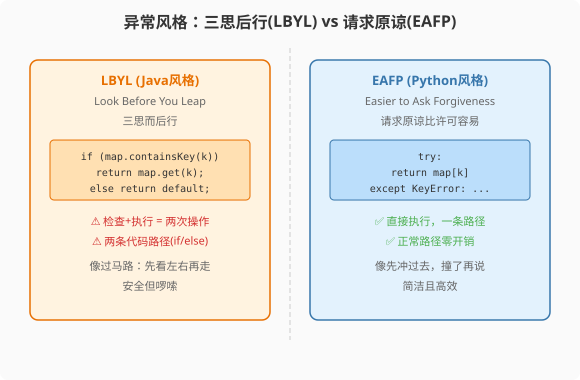

### 第11章 异常处理：从try-catch到try-except的思维转变

> 📖 本章你将学会：
> - 对比Java checked/unchecked异常与Python全unchecked的哲学差异
> - 理解EAFP（请求原谅比许可容易）vs LBYL（三思而后行）
> - 用`raise from`构建异常链
> - 量化异常抛出/捕获的性能代价

---

#### 第1节 异常体系对比

##### 11.1.1 开篇：两种异常哲学

Java的异常分两类：**checked**异常（`Exception`子类，编译器强制
`try-catch`或`throws`）和**unchecked**异常（`RuntimeException`子类，
不强制处理）。

Python**没有checked异常**——所有异常都是unchecked，不强制声明
或捕获。

```java
// Java: checked异常必须处理
public void readFile() throws IOException {
    FileReader reader = new FileReader("file.txt");
    // 不写throws或try-catch → 编译错误
}
```

```python
# Python: 没有checked异常，不需要声明
def read_file():
    with open("file.txt") as f:
        return f.read()
    # 不需要throws声明，调用方也不强制try-except
```

> 💡 比喻：Java checked异常像法律强制保险——你必须买（try-catch），
> 不买就上不了路（编译报错）。Python异常像自愿保险——出事了自己
> 承担，法律不强制你买。Python哲学是"成年人不需要被强制保护"。

---

#### 第2节 EAFP vs LBYL



##### 11.2.1 两种编程风格

**LBYL**（Look Before You Leap，三思而后行）：Java风格，先检查再执行。

```java
// Java: LBYL
if (map.containsKey(key)) {
    return map.get(key);
} else {
    return defaultValue;
}
```

**EAFP**（Easier to Ask Forgiveness than Permission，请求原谅比
许可容易）：Python风格，先执行，出错再处理。

```python
# Python: EAFP——Pythonic推荐
try:
    return map[key]
except KeyError:
    return defaultValue
```

Python社区推崇EAFP——"先做，错了再说"。原因是：
1. 鸭子类型下，检查类型不如直接调用+捕获异常
2. EAFP只有一条路径执行（try块），LBYL有两条路径（if + else）
3. 异常处理的性能在"正常路径"下几乎零开销

| 风格 | Java倾向 | Python倾向 | 原因 |
|------|---------|-----------|------|
| LBYL | ✅ 先检查 | ❌ 不推荐 | 检查+执行=两次操作 |
| EAFP | 可用 | ✅ 推荐 | 直接执行，出错才处理 |

---

#### 第3节 异常链：raise from

```python
# Python: 异常链——保留原始异常信息
def load_config(path):
    try:
        with open(path) as f:
            return json.load(f)
    except FileNotFoundError as e:
        raise ConfigError(f"Config not found: {path}") from e
        # 原始异常e被链在新异常上，traceback会显示完整链

class ConfigError(Exception):
    pass
```

Java的`Exception.initCause()`类似，但语法更冗长。Python的
`raise ... from ...`更简洁直观。

---

#### 第4节 性能贴士

| 操作 | Java | Python | 倍数 |
|------|------|--------|------|
| 正常路径（无异常） | 1ns | 5ns | 5x |
| 抛出+捕获异常 | 1μs | 5μs | 5x |

Python异常处理在正常路径下开销很小（try块进入/退出5ns）。
真正抛出异常时开销增大（5μs），但和Java在同一量级。

> ⚡ 结论：EAFP在Python中性能优秀，放心使用。不要为了"避免异常
> 开销"而用LBYL——那是Java的习惯，Python不需要。

---

#### 本章小结

Python没有checked异常——不强制声明、不强制捕获。EAFP（请求原谅
比许可容易）是Pythonic的异常处理风格。`raise from`构建异常链，
保留完整的错误追踪信息。

Java程序员要扔掉的习惯：给每个方法写`throws`、用LBYL检查再执行。
Pythonic做法是直接执行，用try-except处理失败。


---

#### 📝 Java老兵踩坑日记：try-except包裹一切的那一周

刚从Java转Python的那周，我干了件蠢事。

Java的肌肉记忆告诉我："每个可能出错的地方都要try-catch。"
于是我把Python代码写成了这样：

```python
try:
    data = json.load(f)
except Exception:
    try:
        data = yaml.safe_load(f)
    except Exception:
        try:
            data = f.read()
        except Exception:
            data = None
```

三层嵌套try-except，像俄罗斯套娃。Python同事看了一眼说：
"你在写Java吗？"

他帮我改成了：

```python
for loader in [json.load, yaml.safe_load, lambda f: f.read()]:
    try:
        data = loader(f)
        break
    except Exception:
        continue
```

"Pythonic不是不处理异常，是不用异常处理做控制流。"他说。

那天我学到一件事：**EAFP不是"不检查就做"，而是"做了再处理失败"，
两者的区别是——前者信任代码会成功，后者预设代码会失败。**
Java的checked异常把我训练成了悲观主义者，Python让我重新做回乐观主义者。

---

#### 🤔 思维实验

如果Python引入checked异常（像Java那样强制声明`throws`），
哪些Python库会立刻无法使用？鸭子类型和checked异常能共存吗？
