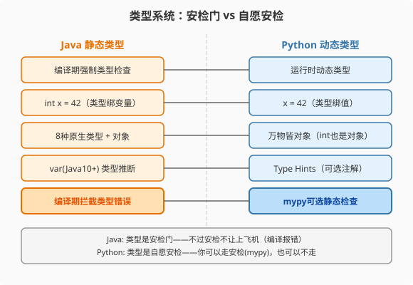

### 第4章 变量与类型系统：从安检门到自愿安检

> 📖 本章你将学会：
> - 理解动态类型本质：变量是标签，不是容器
> - 对比Java 8种原生类型与Python万物皆对象的内存模型
> - 用Type Hints和mypy给Python加上"自愿安检"
> - 量化动态类型的运行时开销

---

#### 第1节 声明语法：类型绑变量 vs 类型绑值

##### 4.1.1 开篇：两种"变量"哲学



Java的变量是一个"容器"——你声明`int x = 42`，编译器在栈上开一个
4字节的格子，贴上`x`标签，往里面放42。类型绑在容器上：这个格子
只能放int，放String就编译报错。

Python的变量是一个"标签"——你写`x = 42`，Python在堆上创建一个
整数对象42，然后把`x`这个标签贴在这个对象上。类型绑在值上：
同一个标签可以先贴int，再贴String，Python不拦你。

> 💡 比喻：Java变量像指定类型的储物柜——42号柜只能放衣服，放书
> 就报警。Python变量像便利贴——你把便利贴贴在42这个数字上，下一秒
> 可以撕下来贴在"hello"这个字符串上。便利贴不关心贴的是什么。

```java
// Java: 类型绑在变量上
int x = 42;
x = "hello";  // ❌ 编译错误：类型不匹配
```

```python
# Python: 类型绑在值上，变量只是标签
x = 42        # x → int(42)
x = "hello"   # x → str("hello")，完全合法
x = [1, 2, 3] # x → list([1,2,3])，也合法
```

---

##### 4.1.2 基本类型对比

Java有8种原生类型（`int/long/float/double/char/byte/short/boolean`），
它们存在栈上，不是对象。需要对象时用包装类（`Integer/Long/...`），
编译器自动装箱拆箱。

Python没有原生类型——**万物皆对象**，包括整数。

```python
x = 42
print(type(x))        # <class 'int'>
print(x.__class__)    # <class 'int'>
print((42).__add__(3))  # 45——整数也有方法！
```

| 类型 | Java | Python | 说明 |
|------|------|--------|------|
| 整数 | int(4字节)/long(8字节) | int（任意精度） | Python int无溢出！ |
| 浮点 | float(4)/double(8) | float(8字节) | Python只有双精度 |
| 布尔 | boolean(1字节) | bool | Python bool是int子类 |
| 字符 | char(2字节) | str(长度1) | Python无char类型 |
| 字符串 | String(对象) | str(对象) | Python字符串不可变 |

> ⚡ Python的`int`是任意精度整数——`2**1000`不会溢出，Java需要
> `BigInteger`。代价是每次整数运算都要检查是否需要扩展精度，比Java
> 的原生`int`慢10-30倍。

---

#### 第2节 动态类型的本质：变量是标签

##### 4.2.1 内存模型对比

```
Java:  栈上格子          Python:  堆上对象 + 标签
       ┌─────────┐               ┌──────────┐
  x ─→ │ int: 42 │          x ──→ │ int(42)  │ ← 标签贴在对象上
       └─────────┘               │ refcount│
                                 └──────────┘
       格子有固定类型             对象有类型，标签没有
       x = "hi" → 报错            x = "hi" → 标签换贴对象
```

Python变量本质是一个指向对象的引用。赋值`x = y`不是拷贝值，
而是让`x`和`y`两个标签贴在同一个对象上。

```python
a = [1, 2, 3]
b = a          # b和a贴同一个list对象
b.append(4)
print(a)       # [1, 2, 3, 4]——a也变了！
```

Java程序员最容易踩的坑：以为`b = a`是拷贝，实际上是引用赋值。
需要拷贝要用`b = a.copy()`或`b = list(a)`。

---

##### 4.2.2 可变与不可变

| 类型 | Java | Python | 可变性 |
|------|------|--------|--------|
| 整数 | int（值类型） | int（不可变对象） | Python不可变 |
| 字符串 | String（不可变） | str（不可变） | 都不可变 |
| 列表 | ArrayList（可变） | list（可变） | 都可变 |
| 元组 | 无对应 | tuple（不可变） | Python特有 |
| 字典 | HashMap（可变） | dict（可变） | 都可变 |

Python特有的`tuple`（元组）是不可变列表——创建后不能修改。
Java没有直接对应物（`List.of()`创建的不可变列表最接近）。

```python
t = (1, 2, 3)     # tuple，不可变
t[0] = 99         # ❌ TypeError: tuple不可变
l = [1, 2, 3]     # list，可变
l[0] = 99         # ✅ OK
```

> 💡 比喻：Python的tuple像刻在石头上的名单——刻好了就不能改。
> list像白板上的名单——随时擦了重写。tuple更安全（不会意外修改），
> 也更快（内存布局紧凑）。

---

#### 第3节 Type Hints：自愿安检

##### 4.3.1 类型注解语法

Python 3.5+引入了Type Hints（类型注解）[^pep-484]，但它是**可选的**——
不写注解代码照跑，写了注解运行时也不检查，只有mypy等静态检查
工具会检查。

```python
# 变量注解
name: str = "Alice"
age: int = 30

# 函数注解
def greet(name: str, times: int = 1) -> str:
    return f"Hello, {name}! " * times

# 容器注解
from typing import List, Dict, Optional

def process(items: List[int]) -> Dict[str, int]:
    return {"count": len(items)}

# Optional表示可能为None
def find(id: int) -> Optional[str]:
    return database.get(id)  # 可能返回None

# Python 3.10+：用 | 表示联合类型（PEP 604），更简洁[^pep-604]
def find(id: int) -> str | None:       # 等价于 Optional[str]
    return database.get(id)

def parse(value: str | int | float):   # 等价于 Union[str, int, float]
    return str(value)
```

| Java | Python Type Hint | 说明 |
|------|-----------------|------|
| `String` | `str` | 字符串 |
| `int` | `int` | 整数 |
| `List<String>` | `list[str]` (3.9+) 或 `List[str]` | 列表 |
| `Map<String, Integer>` | `dict[str, int]` | 字典 |
| `Optional<String>` | `str \| None` (3.10+) | 可空 |

---

##### 4.3.2 mypy：Python的"编译期检查器"

```bash
pip install mypy
mypy my_script.py
```

mypy会像Java编译器一样检查类型错误，但它是**独立的工具**——
不在运行时执行，不改变Python的动态特性。

```python
# 有类型注解的代码
def add(a: int, b: int) -> int:
    return a + b

result = add("1", 2)  # mypy报错：参数类型不匹配
                     # 但python运行时不报错（直到运行到这行）
```

> ⚡ Java程序员建议：在团队项目中使用mypy + Type Hints，获得接近
> Java的类型安全。个人脚本/原型开发可以不用——这是"自愿安检"的精髓。

---

#### 第4节 性能贴士

##### 4.4.1 动态类型的运行时开销

| 操作 | Java (int) | Python (int) | 倍数 |
|------|-----------|-------------|------|
| `a + b` | 1ns | 30-50ns | 30-50x |
| `a * b` | 1ns | 40-60ns | 40-60x |
| 类型检查 `isinstance` | instanceof 2ns | isinstance 50ns | 25x |

Python每次整数运算都要：
1. 检查操作数类型（是int还是float？）
2. 检查是否需要扩展精度
3. 创建新的整数对象（int不可变）
4. 递增新对象的引用计数，递减旧对象的引用计数

Java的原生`int`直接在栈上做CPU加法指令，1纳秒完成。

> ⚡ 这就是为什么纯Python循环比Java慢10-30倍——每次操作都有
> 动态类型的开销。但NumPy用C扩展绕过了这些开销，所以向量化
> 运算可以接近Java速度。第五篇会详细讲解。

---

#### 本章小结

动态类型是Python的核心特征——变量是标签不是容器，类型绑在值上。
这带来了灵活性，也带来了运行时开销。Type Hints + mypy让Python
获得"自愿安检"能力，在保持动态特性的同时获得接近Java的类型安全。

下一章我们看Python的函数——它是真正的一等公民，比Java的Lambda
自由得多。

---

[^pep-484]: PEP 484: Type Hints, Guido van Rossum, Łukasz Langa, Jukka Lehtosalo, 2014-09-29, https://peps.python.org/pep-0484/ — 类型提示标准，Python 3.5 正式引入。Guido van Rossum 亲自创建此 PEP。

[^pep-604]: PEP 604: Allow writing union types as X \| Y, Philip House, 2019-08-06, https://peps.python.org/pep-0604/ — 允许用 `X | Y` 语法替代 `Union[X, Y]`，Python 3.10 正式引入。
