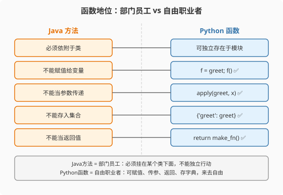

### 第5章 函数与Lambda：从方法到一等公民

> 📖 本章你将学会：
> - 理解Python函数作为一等公民的自由度
> - 用默认参数和关键字参数替代Java方法重载
> - 对比Java Stream Lambda与Python Lambda的边界
> - 量化函数调用开销

---

#### 第1节 函数是一等公民



##### 5.1.1 开篇：从"方法"到"函数"的跨越

Java的"方法"必须依附于类——你不能在类外面写一个独立函数，连`main`
都要包在`public class Main`里。方法是"二等公民"：可以调用，但不能
像数据一样赋值、传参、返回。

Python的"函数"是真正的一等公民——可以赋值给变量，可以当参数传递，
可以当返回值，可以存在字典里。

```python
# Python: 函数就是数据
def greet(name):
    return f"Hello, {name}"

say_hello = greet          # 赋值给变量
print(say_hello("Alice"))  # Hello, Alice

funcs = {"greet": greet, "len": len}  # 存入字典
print(funcs["greet"]("Bob"))  # Hello, Bob

def apply(func, value):    # 函数当参数
    return func(value)

print(apply(greet, "Carol"))  # Hello, Carol

def make_multiplier(n):    # 函数当返回值
    def multiply(x):
        return x * n
    return multiply

double = make_multiplier(2)
print(double(5))  # 10
```

> 💡 比喻：Java的方法像员工——必须挂在某个部门（类）下面，不能
> 独立存在。Python的函数像自由职业者——可以接任何项目的活，
> 可以组队，可以单干。

---

#### 第2节 默认参数与关键字参数：重载终结者

##### 5.2.1 Java重载 vs Python默认参数

Java用方法重载处理"不同参数组合"：

```java
// Java: 3个重载方法
public String format(String value) { return format(value, 0, false); }
public String format(String value, int width) { return format(value, width, false); }
public String format(String value, int width, boolean upper) {
    String result = String.format("%" + width + "s", value);
    return upper ? result.toUpperCase() : result;
}
```

Python用一个函数+默认参数搞定：

```python
# Python: 1个函数，默认参数
def format(value: str, width: int = 0, upper: bool = False) -> str:
    result = f"{value:>{width}}"
    return result.upper() if upper else result

format("hello")              # 用默认值
format("hello", 10)          # 传width
format("hello", 10, True)    # 全传
format("hello", upper=True)  # 关键字参数——只传upper，width用默认
```

| 特性 | Java重载 | Python默认参数 | Python关键字参数 |
|------|---------|--------------|----------------|
| 函数数量 | N个 | 1个 | 1个 |
| 可读性 | 低（名字相同难区分） | 高 | 极高 |
| 灵活性 | 低（参数个数固定） | 高 | 极高 |
| 可选参数 | 不支持 | 支持 | 支持 |

> 💡 关键字参数是Python的杀手锏——`format("hello", upper=True)`
> 一眼看出`upper=True`是什么意思，Java的`format("hello", 10, true)`
> 第三个参数是什么？不看文档你不知道。

---

##### 5.2.2 可变参数

```java
// Java: 可变参数
public int sum(int... nums) {
    return Arrays.stream(nums).sum();
}
sum(1, 2, 3, 4);  // 10
```

```python
# Python: *args 收集为tuple
def sum_all(*nums: int) -> int:
    return sum(nums)
sum_all(1, 2, 3, 4)  # 10

# **kwargs 收集为dict
def create_user(name: str, **kwargs):
    return {"name": name, **kwargs}
create_user("Alice", age=30, city="Beijing")
# {"name": "Alice", "age": 30, "city": "Beijing"}
```

---

#### 第3节 Lambda对比

##### 5.3.1 Java Stream Lambda vs Python Lambda

```java
// Java: Lambda + Stream
List<String> names = users.stream()
    .filter(u -> u.getAge() > 18)
    .map(u -> u.getName().toUpperCase())
    .collect(Collectors.toList());
```

```python
# Python: Lambda + map/filter（但不够Pythonic）
names = list(map(
    lambda u: u.name.upper(),
    filter(lambda u: u.age > 18, users)
))

# Pythonic写法：列表推导（推荐！）
names = [u.name.upper() for u in users if u.age > 18]
```

Python的Lambda**只能写一个表达式**，不能写语句块。这限制了它的
使用场景——复杂逻辑只能用`def`定义命名函数。

```python
# ❌ Python Lambda不能写语句块
# lambda x: if x > 0: return x else: return -x  ← 语法错误

# ✅ 用def
def abs_val(x):
    if x > 0:
        return x
    return -x
```

| 特性 | Java Lambda | Python Lambda |
|------|------------|--------------|
| 语法 | `(x) -> expr` | `lambda x: expr` |
| 函数体 | 表达式或语句块 | 只能一个表达式 |
| 捕获变量 | effectively final | 任意变量（但注意闭包陷阱） |
| 典型用途 | Stream API | 排序key、回调 |
| 复杂逻辑 | 支持 | 不支持，用def |

> 💡 Python社区共识：能用列表推导就不用Lambda+map/filter。Lambda
> 在Python里主要用于`sorted(key=lambda...)`这种"传一个简单key函数"
> 的场景。

---

##### 5.3.2 闭包陷阱

```python
# Python闭包陷阱：延迟绑定
funcs = []
for i in range(3):
    funcs.append(lambda: i)  # 所有lambda捕获的是同一个i

print([f() for f in funcs])  # [2, 2, 2]——不是[0, 1, 2]！

# 修复：用默认参数固定值
funcs = [lambda i=i: i for i in range(3)]
print([f() for f in funcs])  # [0, 1, 2]
```

Java的Lambda有`effectively final`限制，避免了这个问题——
捕获的局部变量必须是final或effectively final。

---

#### 第4节 性能贴士

| 操作 | Java | Python | 倍数 |
|------|------|--------|------|
| 函数调用 | 2-5ns | 70-100ns | 15-30x |
| Lambda调用 | 3-8ns | 80-120ns | 15-20x |
| 默认参数查找 | N/A | +10ns | — |

Python函数调用慢的原因：动态分发（查找`__dict__`）+ 参数打包/解包
+ 引用计数管理。Java的方法调用在JIT优化后可以内联，几乎零开销。

> ⚡ 优化建议：在性能关键循环中，把函数调用内联或用NumPy向量化
> 替代。不要在百万次循环里调用Python函数——开销惊人。

---

#### 本章小结

Python函数是一等公民——可以赋值、传参、返回、存入数据结构。默认参数
和关键字参数让Java的重载模式显得笨重。Python Lambda功能有限（只能
一个表达式），但列表推导式是更Pythonic的替代方案。

注意闭包延迟绑定陷阱——这是Java程序员不会遇到的，因为Java Lambda
有`effectively final`保护。
