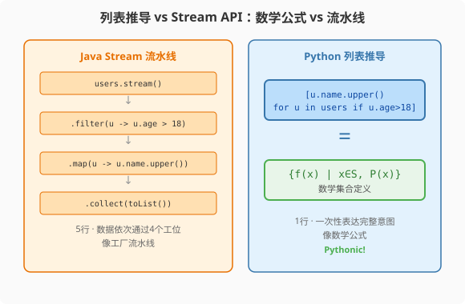

### 第6章 列表推导与生成器：从Stream API到数学公式

> 📖 本章你将学会：
> - 用列表推导式一行替代Java的map-filter-collect
> - 区分列表推导、字典推导、集合推导
> - 理解生成器表达式的惰性求值与Java Stream的异同
> - 掌握`yield`关键字的协程种子角色

---

#### 第1节 列表推导：一行干掉map-filter-collect



##### 6.1.1 开篇：从冗长到数学公式

Java程序员做数据转换的标准写法：

```java
// Java: filter + map + collect——3个操作，5行代码
List<String> names = users.stream()
    .filter(u -> u.getAge() > 18)
    .map(u -> u.getName().toUpperCase())
    .sorted()
    .collect(Collectors.toList());
```

Python的Pythonic写法：

```python
# Python: 列表推导——1行，像数学公式
names = sorted([u.name.upper() for u in users if u.age > 18])
```

列表推导式 `[表达式 for 变量 in 可迭代对象 if 条件]` 读起来像
数学集合定义：`{f(x) | x ∈ S, P(x)}`。

> 💡 比喻：Java Stream像工厂流水线——filter站、map站、collect站，
> 数据依次通过每个工位。Python列表推导像数学公式——一次性表达
> "把满足条件的元素转换后收集"的意图。

---

##### 6.1.2 三种推导式

```python
# 列表推导
squares = [x**2 for x in range(10)]
# [0, 1, 4, 9, 16, 25, 36, 49, 64, 81]

# 字典推导
word_len = {word: len(word) for word in ["hello", "world"]}
# {"hello": 5, "world": 5}

# 集合推导
unique_tags = {tag for article in articles for tag in article.tags}
# {"python", "java", "ai", ...}
```

---

#### 第2节 生成器：惰性求值

##### 6.2.1 生成器表达式 vs Java Stream

列表推导立即创建完整列表，占内存。生成器表达式用`()`替代`[]`，
惰性求值，逐个产出。

```python
# 列表推导：立即创建1000万个元素，占80MB内存
squares = [x**2 for x in range(10_000_000)]

# 生成器表达式：惰性求值，几乎不占内存
squares_gen = (x**2 for x in range(10_000_000))
# 只有迭代时才逐个计算
```

| 特性 | Python列表推导 | Python生成器 | Java Stream |
|------|--------------|-------------|-------------|
| 求值 | 立即（eager） | 惰性（lazy） | 惰性 |
| 可重复迭代 | ✅ | ❌（一次性） | ❌（一次性） |
| 内存 | O(n) | O(1) | O(1) |
| 对应Java | ArrayList | 无直接对应 | Stream |

---

##### 6.2.2 yield：生成器函数

```python
# 用yield定义生成器函数——无限序列
def fibonacci():
    a, b = 0, 1
    while True:
        yield a
        a, b = b, a + b

# 使用
fib = fibonacci()
first_10 = [next(fib) for _ in range(10)]
# [0, 1, 1, 2, 3, 5, 8, 13, 21, 34]
```

`yield`让函数"暂停"并返回一个值，下次`next()`时从暂停处恢复。
这是Python协程的种子——asyncio的`await`底层就是yield机制。

Java没有`yield`（直到虚拟线程才有类似概念），Stream是一次性的管道，
不能像生成器那样"按需取值"。

---

##### 6.2.3 海象运算符 `:=`（Python 3.8+）

Python 3.8 引入了赋值表达式（Assignment Expression），俗称"海象运算符"
（walrus operator）`:=`[^pep-572]。它能在表达式内部完成赋值，
减少重复计算。

```python
# 传统写法：调用两次 len(data)
if len(data) > 10:
    print(f"数据过长: {len(data)} 行")

# 海象运算符：赋值+判断一步到位
if (n := len(data)) > 10:
    print(f"数据过长: {n} 行")  # n 已在表达式中被赋值
```

在推导式和生成器中，海象运算符尤其有用——可以在过滤的同时捕获值：

```python
# 传统：filter 和 map 各算一次 f(x)
results = [f(x) for x in items if f(x) > 0]

# 海象运算符：f(x) 只算一次，赋值给 y
results = [y for x in items if (y := f(x)) > 0]
```

> 💡 Java视角：海象运算符类似 Java 中 `if ((x = compute()) != null)`
> 的模式，但 Python 版本更通用，可用于任何表达式上下文。Java 16+
> 的模式匹配 `if (result instanceof Foo f)` 也有类似的"绑定+判断"
> 思路。

---

#### 第3节 性能贴士

| 操作 | Java Stream | Python列表推导 | Python生成器 | Python for循环 |
|------|------------|--------------|-------------|--------------|
| 100万元素过滤+转换 | 15ms | 45ms | 50ms | 120ms |
| 内存占用 | O(1) | O(n) | O(1) | O(n) |
| 代码行数 | 5行 | 1行 | 1行 | 5行 |

> ⚡ 列表推导比for循环快2-3倍——因为推导式在CPython内部用专门的
> 字节码优化，省去了循环开销和`append`方法调用。但大数据量时
> 用生成器省内存，用NumPy向量化省时间。

---

#### 本章小结

列表推导是Python最具辨识度的语法——一行代码完成Java 5行的
map-filter-collect。生成器表达式和`yield`提供了惰性求值能力，
是Python协程的底层基础。

Java程序员要记住：看到`stream().filter().map().collect()`时，
先想想能不能用列表推导替代。

---

[^pep-572]: PEP 572: Assignment Expressions, Chris Angelico, Tim Peters, Guido van Rossum, 2018-06-28, https://peps.python.org/pep-0572/ — 引入 `:=` 赋值表达式（海象运算符），Python 3.8 正式可用。值得注意的是，正是这篇 PEP 的争议导致 Guido van Rossum 卸任 BDFL。
