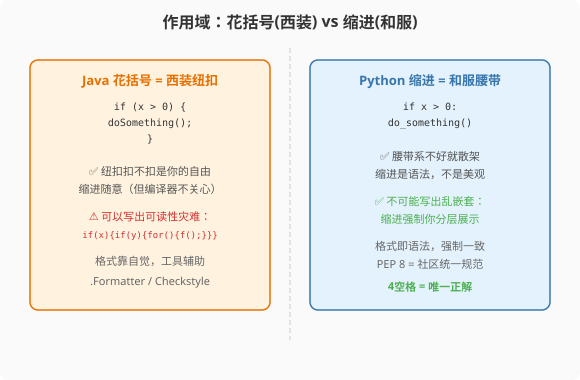

### 第7章 控制流：从花括号到缩进的哲学转变

> 📖 本章你将学会：
> - 理解缩进即作用域的设计哲学，以及为什么 Python 没有花括号
> - 用 `for-in` + `range` / `enumerate` / `zip` 替代 Java 的索引循环
> - 掌握 `match/case` 结构化模式匹配（PEP 634，Python 3.10）——不是 switch，是模式匹配
> - 理解 Python 独有的 `for-else` 循环，以及它为什么让 Java 程序员困惑
> - 用 `with` 语句管理资源生命周期（PEP 343），理解上下文管理器协议
> - 量化 Python 循环与 Java 循环的性能差距，知道何时该用向量化

---

#### 开篇：这不是语法差异，是哲学差异

Java 程序员第一次看 Python 代码，最不习惯的不是少了分号，而是少了花括号。在 Java 里，`{}` 是代码块的物理边界——你可以把代码挤成一行，可以随意缩进，只要花括号对了，编译器就认。Python 彻底删掉了花括号，用缩进表示代码块。这不是语法糖的替换，而是设计哲学的根本分歧。

Java 的哲学是"语法结构和视觉结构分离"——编译器看花括号，人看缩进，两者各管各的。Python 的哲学是"语法结构和视觉结构统一"——缩进既是给人看的，也是给解释器看的，两者不可分离。这意味着：**Python 代码不可能"格式丑但逻辑对"**，因为格式本身就是逻辑。

这种哲学延伸到了整个控制流设计。Python 没有 C 风格的 `for(int i=0; i<n; i++)`，只有 `for-in` 遍历；Python 3.10 引入了 `match/case`，但它不是 Java 的 `switch`，而是来自函数式语言的结构化模式匹配；Python 还有 `for-else` 循环——一个让 Java 程序员百思不得其解的语法。这些设计背后，是同一条原则：**可读性很重要**（PEP 8 的原话[^pep-8-readability]）。

---

#### Java 回顾

Java 的控制流工具箱是 C 语言的传统套装：

```java
// Java: 经典控制流
if (x > 0) {
    doSomething();
} else {
    doOther();
}

// C 风格 for 循环
for (int i = 0; i < items.size(); i++) {
    System.out.println(items.get(i));
}

// for-each 循环（Java 5+）
for (String item : items) {
    System.out.println(item);
}

// switch 语句（Java 14+ 支持表达式形式）
switch (status) {
    case 200 -> System.out.println("OK");
    case 404 -> System.out.println("Not Found");
    default  -> System.out.println("Unknown");
}

// try-with-resources（Java 7+）
try (Connection conn = dataSource.getConnection()) {
    conn.execute(sql);
}  // 自动关闭 conn
```

Java 控制流有三个特点：

1. **花括号定义作用域**：缩进只是约定，不影响编译
2. **switch 是值匹配**：只能比较常量值，不能解构数据结构
3. **资源管理绑定到 try**：`try-with-resources` 只能管理 `AutoCloseable` 接口的对象

> 💡 提示：如果你对 Java 5 的 for-each 和 Java 7 的 try-with-resources 已经很熟悉，可以跳过本节直接看下一节。

---

#### Python 视角

##### 7.1 缩进即作用域



###### 7.1.1 这不是语法糖，是哲学

```java
// Java: 花括号定义作用域，缩进随意（但不推荐）
if (x > 0) {
doSomething();  // 合法但丑
}
```

```python
# Python: 缩进定义作用域，没有花括号
if x > 0:
    do_something()  # 必须4空格缩进
```

> 💡 比喻：Java 像穿西装——花括号是纽扣，扣不扣是你的自由，但不扣不专业。Python 像穿和服——没有纽扣，全靠腰带（缩进）系住，系不好就散了。Python 强制你写出结构清晰的代码。

Python 的缩进规则有明确的规范：PEP 8 建议使用 **4 个空格**缩进，不混用 tab 和空格[^pep-8-readability]。Python 3 不允许在同一个缩进块中混用 tab 和空格，会直接抛出 `TabError`。

###### 7.1.2 为什么 Python 没有花括号

Python 之父 Guido van Rossum 在设计 Python 时，参考了 ABC 语言的缩进语法。ABC 是 Guido 在 CWI（荷兰国家数学与计算机科学研究所）参与开发的教学语言，使用缩进表示代码块。Guido 认为，缩进强制了代码的视觉结构和逻辑结构一致，这减少了"代码看起来是一个意思但实际是另一个意思"的 bug。

这不是没有争议。Python 社区中多次有人提议引入可选花括号（如 `if x > 0: { do_something() }`），但均被拒绝。Python 的立场是：**缩进就是语法**，没有妥协余地。后来社区中流行的一个笑话是——如果你想用花括号，可以用 `#` 注释：

```python
# Java 程序员的 Python "花括号"
if x > 0: #
    do_something() #
```

当然，这只是个玩笑。`#` 后面什么都没有。

###### 7.1.3 缩进的常见陷阱

```python
# ❌ 混用 tab 和空格 → TabError
def func():
    if True:
	    do_something()    # 这里用了 tab
        do_another()      # 这里用了空格

# ❌ 缩进不一致 → IndentationError
if x > 0:
    do_something()
      do_another()  # 多缩进了2格

# ✅ 正确：统一使用4个空格
if x > 0:
    do_something()
    do_another()
```

> ⚠️ 注意：大多数现代编辑器（VS Code、PyCharm）可以配置为"按 Tab 键自动插入 4 个空格"，这是 Python 社区的标准做法。如果你从 Java 转过来，第一步就是把编辑器的 tab 设置改为"插入空格"。

---

##### 7.2 for 循环：没有 `for(int i=0; i<n; i++)`

Python 没有 C 风格的三段式 `for` 循环——没有初始化、条件、步长三段式。Python 的 `for` 只有 `for-in` 遍历，这是一种"迭代器驱动"的设计。

###### 7.2.1 for-in 遍历

```python
# Python: 遍历列表
for item in items:
    print(item)

# 遍历字符串
for ch in "hello":
    print(ch)

# 遍历字典
for key, value in user_dict.items():
    print(f"{key}: {value}")

# 遍历文件行
with open("data.txt") as f:
    for line in f:
        print(line.strip())
```

```java
// Java 等价写法
// for-each 循环（Java 5+）
for (String item : items) {
    System.out.println(item);
}

// 遍历 Map（Java 8+）
for (Map.Entry<String, String> entry : userMap.entrySet()) {
    System.out.println(entry.getKey() + ": " + entry.getValue());
}
```

**关键差异**：Java 的 for-each 只能遍历 `Iterable` 接口的实现类。Python 的 `for-in` 可以遍历任何**可迭代对象**（Iterable）——只要对象实现了 `__iter__()` 方法或 `__getitem__()` 方法。这意味着自定义类只需实现 `__iter__` 就能用 `for-in` 遍历，不需要继承任何接口。

###### 7.2.2 range()：Python 的数字序列

Java 程序员经常需要 `for(int i=0; i<n; i++)` 来生成索引。Python 的 `range()` 函数替代了这一模式：

```python
# range(stop): 0 到 stop-1
for i in range(10):
    print(i)  # 0, 1, 2, ..., 9

# range(start, stop): start 到 stop-1
for i in range(5, 10):
    print(i)  # 5, 6, 7, 8, 9

# range(start, stop, step): 带步长
for i in range(0, 10, 2):
    print(i)  # 0, 2, 4, 6, 8

# 反向遍历
for i in range(10, 0, -1):
    print(i)  # 10, 9, 8, ..., 1
```

```java
// Java 等价写法
for (int i = 0; i < 10; i++) {
    System.out.println(i);
}

// Java 反向
for (int i = 10; i > 0; i--) {
    System.out.println(i);
}
```

> 💡 关键：`range()` 返回的不是列表，而是一个**惰性迭代器**（Python 3 中 `range` 是独立类型）。`range(1000000)` 不会在内存中创建 100 万个数字，它只在迭代时按需计算下一个值。这与 Java 的 `IntStream.range(0, 1000000)` 类似，但语法更简洁。

###### 7.2.3 enumerate()：索引与值兼得

Java 程序员最想念的可能是"既要索引又要值"的循环。Python 提供了 `enumerate()` 函数：

```python
# Python: enumerate 同时获取索引和值
for i, item in enumerate(items):
    print(f"{i}: {item}")

# 指定起始索引（默认从0开始）
for i, item in enumerate(items, start=1):
    print(f"第{i}项: {item}")
```

```java
// Java 等价写法：只能用索引循环
for (int i = 0; i < items.size(); i++) {
    System.out.println(i + ": " + items.get(i));
}

// 或用 IntStream（Java 8+，但更冗长）
IntStream.range(0, items.size())
    .forEach(i -> System.out.println(i + ": " + items.get(i)));
```

`enumerate()` 接受任何可迭代对象，返回 `(index, value)` 元组的迭代器。它比 Java 的索引循环更安全——不会出现 `IndexOutOfBoundsException`，因为它直接遍历迭代器，不通过下标访问。

###### 7.2.4 zip()：并行遍历

当需要同时遍历两个或多个序列时，Python 的 `zip()` 函数极其方便：

```python
# Python: 并行遍历两个列表
names = ["Alice", "Bob", "Charlie"]
ages = [30, 25, 35]
for name, age in zip(names, ages):
    print(f"{name} is {age} years old")

# Python 3.10+ (PEP 618): strict 模式，长度不等时报错
for name, age in zip(names, ages, strict=True):
    print(f"{name} is {age} years old")
# 如果 len(names) != len(ages)，抛出 ValueError
```

```java
// Java 等价写法：没有内置并行遍历，需要手动索引
for (int i = 0; i < Math.min(names.size(), ages.size()); i++) {
    System.out.println(names.get(i) + " is " + ages.get(i));
}
```

PEP 618（Python 3.10）为 `zip()` 增加了 `strict=True` 参数[^pep-618]，当两个序列长度不等时抛出 `ValueError`。这解决了 `zip()` 默认行为（截断到最短序列）可能隐藏 bug 的问题。

---

##### 7.3 match/case：结构化模式匹配（PEP 634）

Python 3.10（2021 年 10 月 4 日发布[^py310-release]）引入了 `match/case` 语句，这是 Python 近十年来最重要的语法新增。它由 Brandt Bucher 和 Guido van Rossum 在 PEP 634 中提出[^pep-634]，动机和原理由 Tobias Kohn 和 Guido van Rossum 在 PEP 635 中阐述[^pep-635]，教程由 Daniel F Moisset 在 PEP 636 中撰写[^pep-636]。

> ⚠️ 注意：`match/case` **不是** Java/C/JavaScript 的 `switch/case`。Brandt Bucher 本人在 PyCon US 2022 的演讲中反复强调："Structural Pattern Matching is not a switch statement!"[^bucher-pycon]。`switch` 只做值比较，`match/case` 做的是**结构匹配和解构**。

###### 7.3.1 最简单的形式：字面量匹配

```python
# Python 3.10+: match/case 基础用法
def http_error(status):
    match status:
        case 400:
            return "Bad Request"
        case 401 | 403:          # OR 模式：多个值合并
            return "Client Error"
        case 404:
            return "Not Found"
        case 418:
            return "I'm a teapot"
        case _:                   # 通配符：匹配任何值
            return "Unknown"
```

```java
// Java 14+: switch 表达式
public String httpError(int status) {
    return switch (status) {
        case 400 -> "Bad Request";
        case 401, 403 -> "Client Error";
        case 404 -> "Not Found";
        case 418 -> "I'm a teapot";
        default -> "Unknown";
    };
}
```

在这个简单例子中，`match/case` 和 `switch` 看起来很像。但差异在下面。

###### 7.3.2 模式匹配的威力：解构

`match/case` 的真正威力在于**解构**——可以从序列、映射、类实例中提取数据：

```python
# 序列模式：匹配并解包
def handle_command(command):
    match command.split():
        case ["quit"]:
            print("Goodbye!")
        case ["go", direction]:
            print(f"Going {direction}")
        case ["pick", item, "from", container]:
            print(f"Picking {item} from {container}")
        case [action, *args]:  # *args 收集剩余元素
            print(f"Action: {action}, Args: {args}")
        case _:
            print("Unknown command")

handle_command("go north")        # Going north
handle_command("pick key from box")  # Picking key from box

# 映射模式：匹配字典结构
def process_config(config):
    match config:
        case {"host": str(host), "port": int(port)}:
            print(f"Connecting to {host}:{port}")
        case {"url": str(url)}:
            print(f"Using URL: {url}")
        case _:
            print("Invalid config")

process_config({"host": "localhost", "port": 8080})  # Connecting to localhost:8080

# 类模式：匹配对象类型和属性
class Point:
    def __init__(self, x, y):
        self.x = x
        self.y = y

def describe_point(point):
    match point:
        case Point(x=0, y=0):
            return "Origin"
        case Point(x=0, y=y):
            return f"Y-axis at {y}"
        case Point(x=x, y=0):
            return f"X-axis at {x}"
        case Point(x=x, y=y):
            return f"Point at ({x}, {y})"
        case _:
            return "Not a point"
```

```java
// Java 等价：没有模式匹配，只能用 if-else + instanceof
public String describePoint(Object point) {
    if (point instanceof Point p) {  // Java 16+ pattern matching for instanceof
        if (p.x == 0 && p.y == 0) return "Origin";
        if (p.x == 0) return "Y-axis at " + p.y;
        if (p.y == 0) return "X-axis at " + p.x;
        return String.format("Point at (%d, %d)", p.x, p.y);
    }
    return "Not a point";
}
```

> 💡 比喻：Java 的 `switch` 像门卫查证件——只看证件号（值）对不对。Python 的 `match/case` 像安检机——不仅看证件号，还拆开你的行李检查里面装了什么（结构），并把检查到的东西贴上标签递给你（绑定变量）。

###### 7.3.3 守卫条件（Guard）

`match/case` 支持在模式后添加 `if` 守卫条件，进一步细化匹配：

```python
# 守卫条件：在模式匹配后追加 if 条件
def classify_number(n):
    match n:
        case n if n < 0:
            return "Negative"
        case 0:
            return "Zero"
        case n if n < 100:
            return "Small positive"
        case _:
            return "Large positive"

# 更实用的例子：只有当用户已激活时才匹配
match user:
    case User(status="active", name=name) if name != "admin":
        grant_access(name)
    case User(status="active", name="admin"):
        grant_admin_access()
    case _:
        deny_access()
```

Java 的 `switch` 没有守卫条件——只能匹配值，不能在 case 中加额外条件判断。

---

##### 7.4 for-else 循环：Python 独有的控制流

Python 有一个让几乎所有 Java/C 程序员困惑的语法：`for-else` 循环。`else` 子句跟在 `for` 循环后面，但它的语义和 `if-else` 中的 `else` **完全不同**。

###### 7.4.1 else 子句的语义

`for-else` 的 `else` 子句在循环**正常结束**（迭代器耗尽，没有遇到 `break`）时执行。如果循环被 `break` 终止，`else` 子句**不执行**[^py-for-else]。

```python
# for-else: else 在循环正常结束时执行
for i in range(5):
    print(i)
else:
    print("Loop completed normally")
# 输出: 0 1 2 3 4 Loop completed normally

# for-else with break: break 跳过 else
for i in range(5):
    if i == 3:
        break
    print(i)
else:
    print("This won't print because break was hit")
# 输出: 0 1 2
```

```java
// Java 没有等价语法，需要用标志变量
boolean found = false;
for (int i = 0; i < 5; i++) {
    if (i == 3) {
        found = true;
        break;
    }
    System.out.println(i);
}
if (!found) {
    System.out.println("Loop completed without break");
}
```

> 💡 理解技巧：Python 官方文档指出，循环的 `else` 子句与 `try` 语句的 `else` 子句更相似，而不是 `if` 语句的 `else`[^py-for-else]。`try-else` 的 `else` 在"没有异常"时执行，`for-else` 的 `else` 在"没有 break"时执行。它们都是"正常情况下的兜底逻辑"。

###### 7.4.2 实际应用：搜索场景

`for-else` 最经典的场景是**搜索**——遍历查找某个元素，找不到时执行默认逻辑：

```python
# 搜索质数（Python 官方教程的经典例子）
for n in range(2, 10):
    for x in range(2, n):
        if n % x == 0:
            print(f"{n} equals {x} * {n // x}")
            break
    else:
        # loop fell through without finding a factor
        print(f"{n} is a prime number")

# 输出:
# 2 is a prime number
# 3 is a prime number
# 4 equals 2 * 2
# 5 is a prime number
# 6 equals 2 * 3
# 7 is a prime number
# 8 equals 2 * 4
# 9 equals 3 * 3
```

```python
# 实际应用：在列表中查找用户
def find_user(user_id, users):
    for user in users:
        if user.id == user_id:
            return user
    else:
        # 循环正常结束（没找到），执行 else
        print(f"User {user_id} not found")
        return None
```

> ⚠️ 注意：`for-else` 在没有 `break` 的循环中使用 `else` 是无意义的——因为 `else` 总会执行。pylint 会对此发出警告 `useless-else-on-loop`。`for-else` 的价值在于配合 `break` 使用。

---

##### 7.5 with 语句：上下文管理器（PEP 343）

###### 7.5.1 上下文管理器协议

Python 的 `with` 语句由 Guido van Rossum 和 Nick Coghlan 在 PEP 343 中提出[^pep-343]，于 Python 2.5（2006 年）引入。它对应 Java 的 `try-with-resources`（Java 7+），但更加通用。

```java
// Java: try-with-resources（Java 7+）
try (Connection conn = dataSource.getConnection()) {
    conn.execute(sql);
}  // 自动调用 conn.close()
```

```python
# Python: with 语句
with get_connection() as conn:
    conn.execute(sql)
# 自动调用 conn.__exit__()——关闭连接
```

Python 的 `with` 比 Java 的 `try-with-resources` 更通用——任何实现了 `__enter__` / `__exit__` 协议的对象都能用 `with`，不限于"资源"。

```python
# with 可以管理任何"进入/退出"场景
with timer("my_operation"):
    do_something()  # 自动计时

with open("data.txt") as f:
    data = f.read()  # 自动关闭文件

import threading
lock = threading.Lock()
with lock:           # 自动获取和释放锁
    do_critical_work()
```

上下文管理器协议的定义如下：

```python
# 自定义上下文管理器
class DatabaseConnection:
    def __enter__(self):
        # 进入 with 块时调用
        # 通常用于获取资源
        self.conn = connect_to_db()
        return self.conn

    def __exit__(self, exc_type, exc_val, exc_tb):
        # 离开 with 块时调用（无论正常退出还是异常）
        # exc_type: 异常类型（无异常时为 None）
        # exc_val: 异常实例（无异常时为 None）
        # exc_tb: traceback 对象（无异常时为 None）
        self.conn.close()
        # 返回 True → 抑制异常（不推荐，除非你确实想吞掉异常）
        # 返回 False/None → 异常继续传播
        return False

# 使用
with DatabaseConnection() as conn:
    conn.execute("SELECT * FROM users")
# conn.close() 在 __exit__ 中自动调用
```

> 💡 比喻：Java 的 `try-with-resources` 像自动感应门——只有携带 `AutoCloseable` 证件的人才能通过。Python 的 `with` 像通用门禁——只要你有 `__enter__` 和 `__exit__` 两个协议方法，不管你是数据库连接、文件、锁还是计时器，都能刷卡通关。

###### 7.5.2 contextlib：用生成器简化上下文管理器

如果不想写一个完整的类，可以用 `contextlib.contextmanager` 装饰器，把一个生成器函数变成上下文管理器：

```python
from contextlib import contextmanager

@contextmanager
def timer(label):
    import time
    start = time.time()
    try:
        yield  # yield 之前的代码 = __enter__，yield 之后的代码 = __exit__
    finally:
        elapsed = time.time() - start
        print(f"{label}: {elapsed:.3f}s")

# 使用
with timer("database query"):
    results = db.query("SELECT * FROM large_table")
# 输出: database query: 1.234s
```

这比写一个类简洁得多。`yield` 之前的代码在进入 `with` 块时执行，`yield` 之后的代码在离开 `with` 块时执行。如果在 `with` 块中发生异常，异常会在 `yield` 处抛出，因此需要用 `try-finally` 确保清理代码始终执行。

###### 7.5.3 Python 3.10+：括号分组的多上下文管理器

Python 3.10 正式支持用括号将多个上下文管理器分组到多行[^py310-paren-ctx]：

```python
# Python 3.10+: 括号分组的多上下文管理器
with (
    open("input.txt") as fin,
    open("output.txt", "w") as fout,
    lock,
):
    for line in fin:
        fout.write(process(line))

# Python 3.9 及以下：只能嵌套或用逗号一行写完
with open("input.txt") as fin, open("output.txt", "w") as fout, lock:
    for line in fin:
        fout.write(process(line))
```

这解决了 Python 长期以来多上下文管理器只能写在一行或嵌套 `with` 的问题。

---

##### 7.6 while 循环与 break / continue / pass

###### 7.6.1 while 循环

Python 的 `while` 循环与 Java 基本一致，但 `while-else` 也有和 `for-else` 相同的语义：

```python
# while 循环
count = 0
while count < 5:
    print(count)
    count += 1

# while-else: 与 for-else 语义相同
while True:
    response = get_input()
    if response == "quit":
        break
    process(response)
else:
    # 只有 while 条件变为 False 时执行（不是 break 退出时）
    print("Loop ended naturally")
```

###### 7.6.2 break / continue / pass

```python
# break: 跳出最内层循环
for i in range(10):
    if i == 5:
        break
    print(i)  # 0, 1, 2, 3, 4

# continue: 跳过本次迭代
for i in range(10):
    if i % 2 == 0:
        continue
    print(i)  # 1, 3, 5, 7, 9

# pass: 空操作占位符（Java 没有等价物）
class EmptyClass:
    pass  # 什么都不做，但语法需要一个语句

def not_implemented_yet():
    pass  # TODO: 以后实现
```

> 💡 `pass` 是 Python 特有的——它是一个"什么都不做"的语句，纯粹用于语法占位。Java 不需要 `pass`，因为 Java 用 `{}` 表示空块。Python 用缩进表示块，缩进块内不能为空，所以需要 `pass` 占位。

---

#### 代码实战

**场景描述**：实现一个命令行解析器，根据用户输入的命令执行不同操作，展示 `match/case` 模式匹配的实战价值。

```python
# Python 3.10+ 实现
from dataclasses import dataclass

@dataclass
class User:
    id: int
    name: str
    role: str

def parse_and_execute(raw_input: str, current_user: User) -> str:
    """解析命令行输入并执行相应操作"""
    tokens = raw_input.split()

    match tokens:
        # 单词命令
        case ["quit" | "exit"]:
            return "Goodbye!"

        case ["help"]:
            return "Available commands: quit, status, send <message>, admin <action>"

        # 带参数的命令
        case ["status"]:
            return f"User: {current_user.name}, Role: {current_user.role}"

        case ["send", message]:
            return f"Message sent: {message}"

        # 管理员命令（带守卫条件）
        case ["admin", action] if current_user.role == "admin":
            match action:
                case "list_users":
                    return "Listing all users..."
                case "shutdown":
                    return "Shutting down server..."
                case _:
                    return f"Unknown admin action: {action}"

        case ["admin", _]:
            return "Permission denied: admin role required"

        # 通配符：未知命令
        case [command, *args]:
            return f"Unknown command '{command}' with args: {args}"

        case _:
            return "Empty input. Type 'help' for available commands."


# 测试
admin = User(1, "Alice", "admin")
regular = User(2, "Bob", "user")

print(parse_and_execute("help", regular))
# Available commands: quit, status, send <message>, admin <action>

print(parse_and_execute("send hello world", regular))
# Message sent: hello world

print(parse_and_execute("admin list_users", admin))
# Listing all users...

print(parse_and_execute("admin list_users", regular))
# Permission denied: admin role required

print(parse_and_execute("foobar arg1 arg2", regular))
# Unknown command 'foobar' with args: ['arg1', 'arg2']
```

```java
// Java 等价实现：用 if-else 链 + instanceof
public String parseAndExecute(String rawInput, User currentUser) {
    String[] tokens = rawInput.split("\\s+");

    if (tokens.length == 0) {
        return "Empty input. Type 'help' for available commands.";
    }

    String command = tokens[0];

    if (command.equals("quit") || command.equals("exit")) {
        return "Goodbye!";
    }

    if (command.equals("help")) {
        return "Available commands: quit, status, send <message>, admin <action>";
    }

    if (command.equals("status")) {
        return "User: " + currentUser.getName() + ", Role: " + currentUser.getRole();
    }

    if (command.equals("send") && tokens.length >= 2) {
        String message = String.join(" ", Arrays.copyOfRange(tokens, 1, tokens.length));
        return "Message sent: " + message;
    }

    if (command.equals("admin") && tokens.length >= 2) {
        if (!"admin".equals(currentUser.getRole())) {
            return "Permission denied: admin role required";
        }
        String action = tokens[1];
        if (action.equals("list_users")) {
            return "Listing all users...";
        } else if (action.equals("shutdown")) {
            return "Shutting down server...";
        } else {
            return "Unknown admin action: " + action;
        }
    }

    return "Unknown command '" + command + "'";
}
```

**关键差异解读**：
- **模式解构 vs 字符串拼接**：Python 的 `case ["send", message]` 一步完成"检查命令名"和"提取参数"，Java 需要分别检查 `tokens[0]` 和拼接 `tokens[1:]`。
- **OR 模式**：Python 的 `case ["quit" | "exit"]` 用 `|` 合并多个匹配，Java 只能写两个 `if` 或用 `||`。
- **守卫条件**：Python 的 `case ["admin", action] if current_user.role == "admin"` 在模式匹配后直接加条件，Java 需要嵌套 `if`。
- **嵌套 match**：Python 可以在 `case` 块内再嵌套 `match`，Java 需要继续嵌套 `if-else`。

---

#### ⚡ 性能贴士

| 循环方式 | Java | Python | 倍数 |
|---------|------|--------|------|
| 索引循环 100 万次 | 3ms | 45ms | 15x |
| for-each / for-in | 2ms | 35ms | 18x |
| Stream / 推导式 | 5ms | 15ms | 3x |
| 向量化（NumPy） | N/A | 0.5ms | — |

Python 循环慢 10-15 倍是动态类型的代价——每次循环都要做类型检查和方法分派。但在性能关键场景，有三种优化手段：

```python
# 1. 列表推导比 for 循环快 2-3x
# 慢：for 循环
result = []
for x in range(1000000):
    result.append(x * 2)

# 快：列表推导
result = [x * 2 for x in range(1000000)]

# 2. 生成器表达式：惰性求值，省内存
# 适用于只需要遍历一次的场景
total = sum(x * 2 for x in range(1000000))  # 不创建中间列表

# 3. NumPy 向量化：比 for 循环快 50-100x
import numpy as np
arr = np.arange(1000000)
result = arr * 2  # 整个数组一次操作，C 层循环
```

> 💡 性能口诀：简单循环用推导式，大数据用 NumPy，I/O 密集用异步。Python 循环慢不是问题——知道什么时候不用循环才是关键。

---

#### 踩坑日记：把 match/case 当 switch 用

> 📝 第一人称踩坑记录

"刚学 Python 3.10 的 `match/case` 时，我直接把它当 Java 的 `switch` 用——全写字面量匹配。代码能跑，但完全没发挥它的威力。

直到有一次，我在写一个 API 路由分发器，有一堆 `if-elif-else` 判断请求路径和方法。我最初写的是：

```python
if path == '/users' and method == 'GET':
    return list_users()
elif path == '/users' and method == 'POST':
    return create_user()
elif path.startswith('/users/') and method == 'GET':
    user_id = path.split('/')[-1]
    return get_user(user_id)
```

然后我突然意识到——这不就是 `match/case` 的序列模式 + 类模式的用武之地吗？改成：

```python
match (method, path.split('/')):
    case ('GET', ['', 'users']):
        return list_users()
    case ('POST', ['', 'users']):
        return create_user()
    case ('GET', ['', 'users', user_id]):
        return get_user(user_id)
```

代码瞬间清晰了——不用手动解析路径，`match` 自动解构并绑定变量。从那以后我明白了：`match/case` 不是 `switch` 的替代品，它是 `if-elif-else` + `isinstance` + 解包赋值的**三合一升级**。"

---

#### 思维实验

> 🤔 思考题：Python 的 `for-else` 语法自 Python 2.x 就存在，但 2024 年 9 月，CPython 的官方教程才为 `for-else` 增加了独立章节[^py-for-else-section]。为什么社区对这个语法的态度如此纠结？它到底是一个优秀的设计还是 Python 的历史包袱？

提示：思考 `else` 这个关键词在 `if`、`for`、`try` 三种语境下的语义是否一致。Python 之父 Guido van Rossum 曾在邮件列表中讨论过是否应该用 `nobreak` 替代 `else`——你觉得哪个更好？

---

#### 本章小结

1. **缩进即语法**：Python 用缩进替代花括号不是语法糖，是"可读性优先"哲学的体现 —— 像和服靠腰带系住，不靠纽扣
2. **for-in 替代索引循环**：`for-in` + `range` / `enumerate` / `zip` 覆盖了 Java 索引循环的所有场景，且更安全 —— 不会有 `IndexOutOfBoundsException`
3. **match/case 不是 switch**：PEP 634（Brandt Bucher & Guido van Rossum，Python 3.10）引入的结构化模式匹配，不仅匹配值，还能解构序列、映射、类实例 —— 像安检机而非门卫
4. **for-else 是搜索利器**：`else` 在循环正常结束时执行，最适合"找不到就走默认逻辑"的搜索场景 —— 语义类似 `try-else`（无异常时执行），不是 `if-else`
5. **with 是通用资源管理**：PEP 343（Guido van Rossum & Nick Coghlan，Python 2.5）引入的上下文管理器比 Java 的 `try-with-resources` 更通用 —— 任何有 `__enter__`/`__exit__` 的对象都能用

> 🤔 下一章预告：掌握了控制流之后，下一章我们进入 Python 的面向对象世界——从 Java 的 `class` 到 Python 的 `class`，看似相似，实则暗藏玄机。

---

[^pep-8-readability]: PEP 8: Style Guide for Python Code, Guido van Rossum, Barry Warsaw, Nick Coghlan, 2001-07-05, https://peps.python.org/pep-0008/ — "Readability counts" 是 PEP 8 的核心原则之一。PEP 8 建议使用 4 个空格缩进，不混用 tab 和空格。

[^pep-634]: PEP 634: Structural Pattern Matching: Specification, Brandt Bucher, Guido van Rossum, 2020-09-12, https://peps.python.org/pep-0634/ — Python 3.10 引入，由 Python 指导委员会于 2021-02-08 接受。取代了之前的 PEP 622（由 6 位作者撰写，后拆分为 PEP 634/635/636 三个 PEP）。

[^pep-635]: PEP 635: Structural Pattern Matching: Motivation and Rationale, Tobias Kohn, Guido van Rossum, 2020-09-12, https://peps.python.org/pep-0635/ — 阐述了引入模式匹配的动机：替代 `if-elif-else` + `isinstance` + `hasattr` 的临时判断模式，以及 Visitor 模式的冗长代码。

[^pep-636]: PEP 636: Structural Pattern Matching: Tutorial, Daniel F Moisset, 2020-09-12, https://peps.python.org/pep-0636/ — Sponsor: Guido van Rossum。以文字冒险游戏为示例，循序渐进地介绍模式匹配的各种用法。

[^py310-release]: Python 3.10.0 Release, Pablo Galindo Salgado (Release Manager), 2021-10-04, https://www.python.org/downloads/release/python-3100/ — Python 3.10 于 2021 年 10 月 4 日发布，包含 PEP 634/635/636 结构化模式匹配、PEP 604 联合类型语法、PEP 618 zip strict 模式等新特性。

[^bucher-pycon]: Brandt Bucher, "A Perfect Match: The history, design, implementation, and future of Python's structural pattern matching", PyCon US 2022, 2022-04-29, https://github.com/brandtbucher — Brandt Bucher 是 PEP 634 的主要作者和实现者，CPython 核心开发者，时任微软 CPython 性能工程团队成员。

[^pep-618]: PEP 618: Add Optional Length-Checking To zip, Brandt Bucher, 2020-05-01, https://peps.python.org/pep-0618/ — Python 3.10 引入 `zip(strict=True)` 参数，当迭代器长度不等时抛出 `ValueError`，避免静默截断隐藏 bug。

[^pep-343]: PEP 343: The "with" Statement, Guido van Rossum, Nick Coghlan, 2005-05-13, https://peps.python.org/pep-0343/ — Python 2.5 引入 `with` 语句和上下文管理器协议（`__enter__`/`__exit__`）。Python 2.5 需 `from __future__ import with_statement` 启用，Python 2.6 起默认启用。

[^py-for-else]: Python Tutorial: "break and continue Statements, and else Clauses on Loops", Python Official Documentation, https://docs.python.org/3/tutorial/controlflow.html — 官方文档明确说明：循环的 `else` 子句与 `try` 语句的 `else` 子句更相似（"no exception" → "no break"），而非 `if` 语句的 `else`。教程中使用质数搜索作为经典示例。

[^py310-paren-ctx]: Python 3.10 What's New: "Parenthesized context managers", https://docs.python.org/3/whatsnew/3.10.html — Python 3.10 正式支持用括号将多个上下文管理器分组到多行（bpo-12782），由 Guido van Rossum, Pablo Galindo 和 Lysandros Nikolaou 贡献。

[^py-for-else-section]: CPython commit GH-123946, Jelle Zijlstra & Ned Batchelder, 2024-09-25, https://github.com/python/cpython/commit/48359c5c90 — 为 Python 官方教程中的 `for-else` 增加独立章节，此前的 `for-else` 说明与 `break`/`continue` 混在同一节中。
