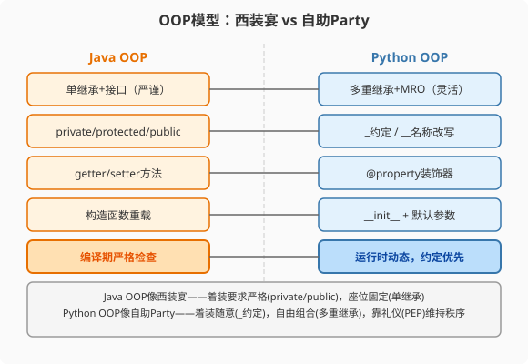

### 第8章 面向对象：从西装宴到自助Party

> 📖 本章你将学会：
> - 理解Python多重继承与MRO的协作机制
> - 用`_`/`__`命名约定替代Java的访问修饰符
> - 用魔术方法（dunder）实现运算符重载和协议
> - 用@property替代getter/setter

---

#### 第1节 类定义对比



```java
// Java: 严谨但冗长
public class User {
    private String name;
    private int age;

    public User(String name, int age) {
        this.name = name;
        this.age = age;
    }

    public String getName() { return name; }
    public void setName(String name) { this.name = name; }
    public int getAge() { return age; }
    public void setAge(int age) { this.age = age; }
}
```

```python
# Python: 简洁，属性默认公开
class User:
    def __init__(self, name: str, age: int):
        self.name = name   # 直接公开，不需要getter/setter
        self.age = age

user = User("Alice", 30)
user.name = "Bob"  # 直接赋值，不需要setName()
```

> 💡 比喻：Java的类像西装宴——每个属性都要穿戴整齐（getter/setter），
> 访问要按礼仪（private + public方法）。Python的类像自助Party——
> 属性默认公开，随意访问，需要保护时再加`_`前缀。

---

#### 第2节 继承与MRO

##### 8.2.1 多重继承

Java只允许单继承（一个`extends`）+ 多接口实现。Python允许真正的
多重继承——一个类可以`extends`多个父类。

```python
class Runnable:
    def run(self):
        print("running")

class Swimmer:
    def swim(self):
        print("swimming")

class Athlete(Runnable, Swimmer):  # 多重继承
    pass

a = Athlete()
a.run()   # running
a.swim()  # swimming
```

Java要实现同样功能需要接口+默认方法，或组合模式。

##### 8.2.2 MRO：方法解析顺序

多重继承的"菱形问题"——A→B,C→D，D调用`super()`时走哪个父类？

Python用**C3线性化算法**确定MRO（Method Resolution Order），
保证调用顺序一致且可预测。该算法最初为 Dylan 语言设计（1996 年 OOPSLA 论文）[^c3-linearization]，Python 2.3 开始采用。

```python
class A:
    def hello(self): print("A")

class B(A):
    def hello(self): print("B")

class C(A):
    def hello(self): print("C")

class D(B, C):
    def hello(self): print("D")

D().hello()  # D
# D的MRO: [D, B, C, A, object]
# super()按MRO顺序调用下一个
```

> ⚠️ Java程序员陷阱：Python的`super()`不像Java那样"调用父类"，
> 而是按MRO调用"下一个类"。在多重继承中，`super()`可能调用的
> 不是你的直接父类，而是MRO链中的下一个兄弟类。

---

#### 第3节 命名约定替代访问修饰符

| Java | Python | 说明 |
|------|--------|------|
| `public` | 无前缀 | 默认公开 |
| `protected` | `_` 前缀 | 约定"内部使用"，不强制 |
| `private` | `__` 前缀 | 名称改写，较难访问（非真私有） |
| `final` | 无对应 | 全大写命名约定 |

```python
class MyClass:
    public_var = "everyone can access"
    _internal_var = "please don't touch outside"
    __private_var = "name mangled to _MyClass__private_var"
```

Python没有真正的`private`——`__`前缀只是名称改写（name mangling），
把`__var`变成`_ClassName__var`，仍然可以通过`obj._ClassName__var`
访问。Python哲学是"we are all consenting adults"（我们都是成年人），
不强制禁止访问。

---

#### 第4节 魔术方法与@property

##### 8.4.1 运算符重载

Java不支持运算符重载。Python通过魔术方法（dunder methods）实现：

```python
class Vector:
    def __init__(self, x, y):
        self.x = x
        self.y = y

    def __add__(self, other):  # 重载 + 运算符
        return Vector(self.x + other.x, self.y + other.y)

    def __repr__(self):  # 重载打印
        return f"Vector({self.x}, {self.y})"

v1 = Vector(1, 2)
v2 = Vector(3, 4)
print(v1 + v2)  # Vector(4, 6)
```

---

##### 8.4.2 @property替代getter/setter

```python
class Temperature:
    def __init__(self, celsius):
        self._celsius = celsius

    @property
    def fahrenheit(self):
        return self._celsius * 9/5 + 32

    @fahrenheit.setter
    def fahrenheit(self, f):
        self._celsius = (f - 32) * 5/9

temp = Temperature(100)
print(temp.fahrenheit)  # 212.0——像属性访问，实际调用getter
temp.fahrenheit = 32    # 像属性赋值，实际调用setter
```

> 💡 Java的getter/setter是"方法伪装属性"——你写`getName()`但调用
> 时记得加`()`。Python的`@property`是"属性伪装方法"——你定义方法
> 但调用时不加`()`。Python的做法更自然：从使用者的角度看，`name`
> 就是一个属性，底层是方法还是变量不重要。

---

#### 第5节 性能贴士

| 操作 | Java | Python | 倍数 |
|------|------|--------|------|
| 属性访问 | 1ns（字段）/ 3ns（getter） | 35ns | 12-35x |
| 方法调用 | 2ns | 70ns | 35x |
| `@property`访问 | N/A | 50ns | — |

Python属性访问慢是因为每次都要查`__dict__`（哈希表查找）。Java
的字段访问是编译期确定的偏移量，几乎零开销。

> ⚡ 优化：对性能关键的对象用`__slots__`（第22章详解），省去
> `__dict__`查找，属性访问快2-3倍。

---

#### 本章小结

Python的OOP比Java灵活——多重继承、运行时修改类、魔术方法重载
运算符。代价是没有编译期安全网，靠命名约定和社区规范维持秩序。

`@property`是getter/setter的Pythonic替代——从使用者角度看就是
普通属性，底层逻辑可以随时改变而不影响调用方。

---

[^c3-linearization]: Barrett, K., Beazley, C., Garrigue, J., Huntley, H., Lindsaar, M. M. (1996). "A Monotonic Superclass Linearization for Dylan." OOPSLA '96 Proceedings. — 该论文提出 C3 单调超类线性化算法，最初为 Dylan 语言设计，后被 Python 2.3、Perl 6 等语言采用。
