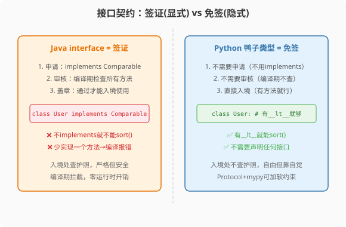

### 第9章 鸭子类型与协议：当接口变成"看起来像就行"

> 📖 本章你将学会：
> - 理解鸭子类型的隐式契约与Java接口的显式契约差异
> - 用ABC给鸭子类型加"软约束"
> - 用Protocol（PEP 544）实现静态检查的鸭子类型
> - 量化鸭子类型的性能代价

---

#### 第1节 鸭子类型：隐式契约



##### 9.1.1 开篇："如果它走起来像鸭子"

Java的接口是显式契约——你必须写`implements Comparable`，编译器
在编译期检查你是否实现了所有方法。

Python的鸭子类型是隐式契约——"如果它走起来像鸭子，叫起来像鸭子，
那它就是鸭子"。不需要声明`implements`，只要有同名方法就行。

```java
// Java: 显式implements
public class User implements Comparable<User> {
    @Override
    public int compareTo(User other) { ... }
}
// Collections.sort() 要求 List<T extends Comparable<? super T>>
```

```python
# Python: 鸭子类型——有__lt__方法就能排序
class User:
    def __init__(self, name, age):
        self.name = name
        self.age = age

    def __lt__(self, other):  # 定义"小于"运算符
        return self.age < other.age

users = [User("Alice", 30), User("Bob", 25)]
users.sort()  # 不需要implements Comparable，有__lt__就行
```

> 💡 比喻：Java接口像签证——你必须申请(implements)、审核(编译检查)、
> 盖章才能入境。鸭子类型像免签——你长得像本地人(有同名方法)，
> 就能自由进出，入境处不查护照。

---

#### 第2节 ABC与Protocol

##### 9.2.1 ABC：软约束

```python
from abc import ABC, abstractmethod

class Shape(ABC):
    @abstractmethod
    def area(self) -> float: ...

class Circle(Shape):
    def area(self) -> float:
        return 3.14 * self.r ** 2

# shape = Shape()  # ❌ TypeError: 不能实例化ABC
circle = Circle()  # ✅ 实现了area才能实例化
```

ABC给鸭子类型加了一层"软约束"——继承ABC但没实现抽象方法，
实例化时报错。但运行时报错，不是编译期。

##### 9.2.2 Protocol：静态鸭子类型

PEP 544引入`Protocol`——结合了鸭子类型的灵活性和静态检查的安全性：

```python
from typing import Protocol

class Comparable(Protocol):
    def __lt__(self, other) -> bool: ...

def sort_items(items: list[Comparable]):
    items.sort()

# 任何有__lt__方法的类都"隐式满足"Comparable
# 不需要显式继承，mypy能静态检查
```

| 特性 | Java interface | Python ABC | Python Protocol |
|------|--------------|-----------|----------------|
| 声明 | 显式implements | 显式继承 | 隐式满足 |
| 检查时机 | 编译期 | 运行时 | mypy静态检查 |
| 灵活性 | 低 | 中 | 高 |

---

#### 第3节 性能贴士

鸭子类型的代价：每次方法调用都要在`__dict__`中查找方法是否存在。

| 操作 | Java instanceof | Python isinstance | Python属性查找 |
|------|----------------|-----------------|--------------|
| 耗时 | 2ns | 50ns | 35ns |

> ⚡ 鸭子类型在性能关键路径上用`__slots__`+Protocol组合：`__slots__`
> 加速属性查找，Protocol提供静态类型安全。

---

#### 本章小结

鸭子类型是Python灵活性的核心——不需要显式声明接口关系，有方法
就行。ABC提供"软约束"，Protocol提供静态检查能力。这是Java→Python
最大的思维转变之一：从"先定义接口再实现"到"先实现再隐式匹配"。
